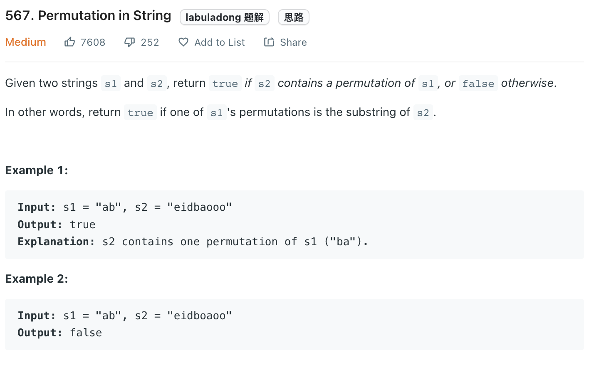

___
[567. Permutation in String](https://leetcode.com/problems/permutation-in-string/)
___


## 基本思路
* There is an easy way by using HashMap.
* For example
* The input is s1 = `abcc`, s2 = `cbdabcc`
* We will s1 to Map
* Then for each lenth of s1 in s2, we also convert into Map and then compare.
* 1. convert `cbda` to map, not ok
* 2. convert `bdab` to map, not ok
* 3. convert `dabc` to map, not ok
* 4. convert `abcc` to map, Yes

___

`Time complexity : O()`

`Space complexity : O()`
```python
class Solution:
    def checkInclusion(self, s1: str, s2: str) -> bool:
        dic1 = collections.Counter(s1)
        
        for i in range(len(s2) - len(s1) + 1):
            dic2 = collections.Counter(s2[i: i + len(s1)])
            if (dic1 == dic2):
                return True
        return False
```

___

```python
class Solution:
    def checkInclusion(self, s1: str, s2: str) -> bool:
        need = collections.Counter(s1)
        window = {}
        left = right = valid = 0
        
        while right < len(s2):
            char = s2[right]
            right += 1
            
            if char in need:
                window[char] = window.get(char, 0) + 1
                if window[char] == need[char]:
                    valid += 1
            
            while right - left >= len(s1):
                if valid == len(need):
                    return True
                
                char = s2[left]
                left += 1
                
                if char in need:
                    if window[char] == need[char]:
                        valid -= 1
                    window[char] -= 1
                    
        return False
```