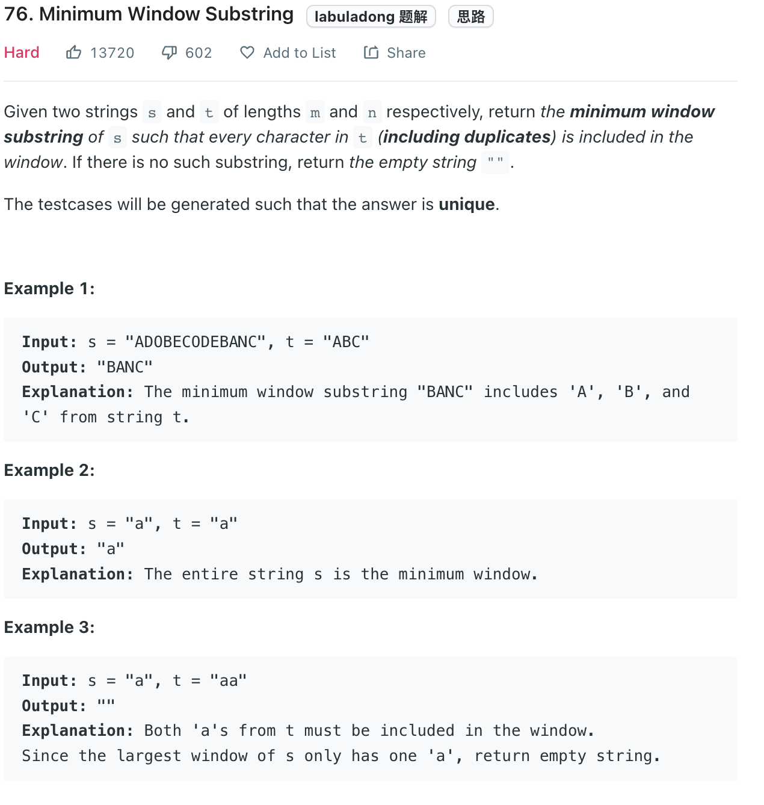

___
[76. Minimum Window Substring](https://leetcode.com/problems/minimum-window-substring/)
___

## 分析问题
* 

## 基本思路
* labuladong yyds

___

`Time complexity : O(n)`

`Space complexity : O(n)`
```python
class Solution:
    def minWindow(self, s: str, t: str) -> str:
        need = collections.Counter(t)
        window = {}
        
        left = right = valid = 0
        start, length = 0, float('inf')
        
        while right < len(s):
            char = s[right]
            right += 1
            
            if char in need:
                window[char] = window.get(char, 0) + 1
                if window[char] == need[char]:
                    valid += 1
                    
            while valid == len(need):
                if right - left < length:
                    start = left
                    length = right - left
                
                char = s[left]
                left += 1
                
                if char in need:
                    if window[char] == need[char]:
                        valid -= 1
                    window[char] -= 1
                    
        if length == float('inf'):
            return ''
        else:
            return ''.join(s[start: start + length])
                
```