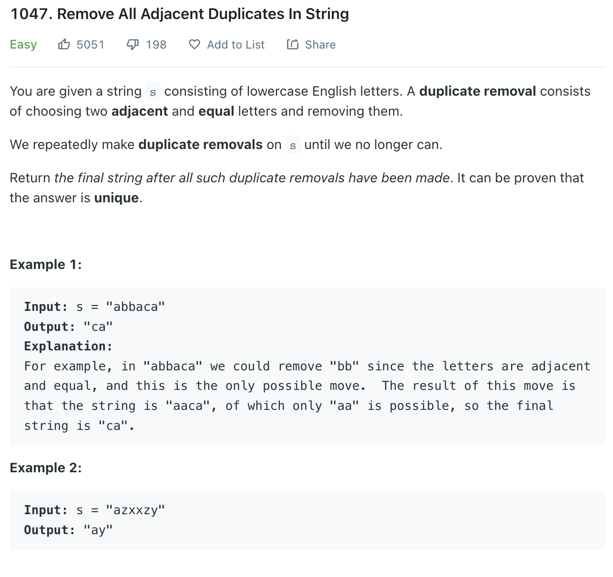

___
[1047. Remove All Adjacent Duplicates In String](https://leetcode.com/problems/remove-all-adjacent-duplicates-in-string/)
___


## 基本思路
* Same as [1544. Make The String Great](https://github.com/longlonglu/shuati/blob/main/two_pointers/1544.%20Make%20The%20String%20Great/1544.%20Make%20The%20String%20Great.md)

___

`Time complexity : O(n)`

`Space complexity : O(n)`
```python
class Solution:
    def removeDuplicates(self, s: str) -> str:
        stack = []
        
        for c in s:
            if stack and stack[-1] == c:
                stack.pop()
            else:
                stack.append(c)
        return ''.join(stack)
```