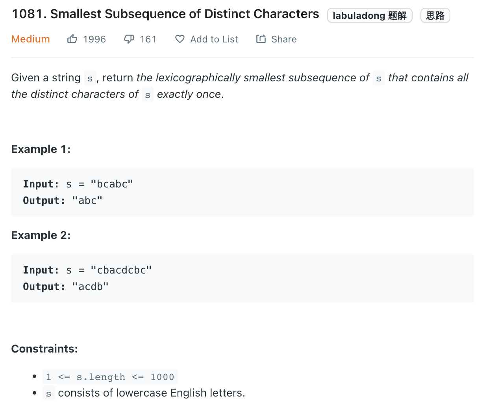

___
[1081. Smallest Subsequence of Distinct Characters](https://leetcode.com/problems/smallest-subsequence-of-distinct-characters/)
___


## 基本思路
* `lexicographically smallest` means `a` should come before `b`
* The key point of this question is `lexicographically smallest` 
* We can use monotonic stack to store the characters in `lexicographically smallest`
* We first count all input characters into `count` and having a set called `visited`
* We go over the input
* When ever we see a char, we decrease the `count`
* If the top element of stack is greater than current char.
* For example top element is `b` and current char is `a`, 
* And `count[b]` is not == 0, (means, we will meet another `b` in the future)
* We pop `b` from the stack and remove it from `visited`
* And then, we append `a` into `stack` and mark `a` as visited

___

`Time complexity : O(n)`

`Space complexity : O(1)`
```python
class Solution:
    def smallestSubsequence(self, s: str) -> str:
        count = collections.Counter(s)
        
        stack = []
        visited = set()
        
        for char in s:
            count[char] -= 1
            
            if char in visited:
                continue
                
            while stack and stack[-1] > char:
                if count[stack[-1]] == 0:
                    break
                visited.remove(stack.pop())
                
            stack.append(char)
            visited.add(char)
        
        answer = ''.join(stack)
        return answer
```