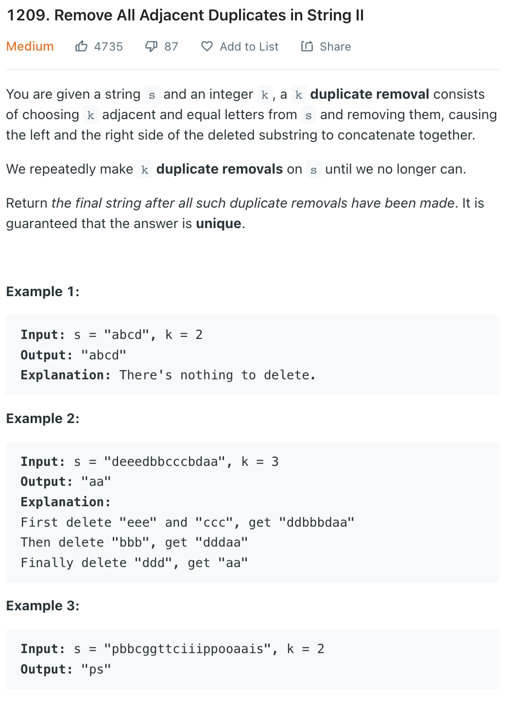

___
[1209. Remove All Adjacent Duplicates in String II](https://leetcode.com/problems/remove-all-adjacent-duplicates-in-string-ii/)
___


## 基本思路
* This is a different Stack question.
* Usually we push the input into Stack, but we need to think different on this quesiton
* For example this question[1047. Remove All Adjacent Duplicates In String](https://github.com/longlonglu/shuati/blob/main/stack/1047.%20Remove%20All%20Adjacent%20Duplicates%20In%20String/1047.%20Remove%20All%20Adjacent%20Duplicates%20In%20String.md)
* We can push char into the Stack, and pop if adjacnet is equal
* If we use same strategy on this question, it will be really complicate and waste a lot of time.
* So be sure to remeber This version of Stack question.
* We can use StringBilder to easily remove range chars
* Istead of pushing each char into the stack, we can push the counts of each char into `Stack`
* If current char is not equal to previous char, we push 1.
* If current char equals previous char, we increment the counts + 1.
* If the `counts` == `k`, we delete those chars
* Else, we repush the counts into stack 

___

`Time complexity : O(n)`

`Space complexity : O(n)`
```java
class Solution {
    public String removeDuplicates(String s, int k) {
        StringBuilder sb = new StringBuilder(s);
        Stack<Integer> stack = new Stack<>();
        
        for (int i = 0; i < sb.length(); i++) {
            if (i == 0 || sb.charAt(i) != sb.charAt(i - 1)) {
                stack.push(1);
            } else {
                int counts = stack.pop() + 1;
                if (counts == k) {
                    sb.delete(i - k + 1, i + 1);
                    i = i - k;
                } else {
                    stack.push(counts);
                }
            }
        }
        return sb.toString();
    }
}
```