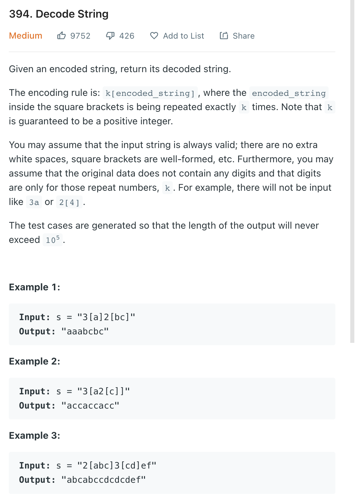

___
[394. Decode String](https://leetcode.com/problems/decode-string/)
___

## 基本思路
* This is normal Stack question.
* Note, there may have multiple digits

___

`Time complexity : O(n)`

`Space complexity : O(n)`
```python
class Solution:
    def decodeString(self, s: str) -> str:
        stack = []
        
        i = 0
        
        while i < len(s):
            char = s[i]
            if char == '[':
                i += 1
                continue
            if char == ']':
                tempString = ""
                while not stack[-1].isdigit():
                    tempString += stack.pop()
                tempCount = int(stack.pop())
                tempString *= tempCount
                stack.append(tempString)
            elif char.isdigit():
                tempCount = ""
                while i < len(s) and s[i].isdigit():
                    tempCount += s[i]
                    i += 1
                stack.append(tempCount)
            else:
                stack.append(char)
            i += 1
        
        answer = []
        while stack:
            answer.append(stack.pop())
        
        return ''.join(answer)[::-1]
                
```