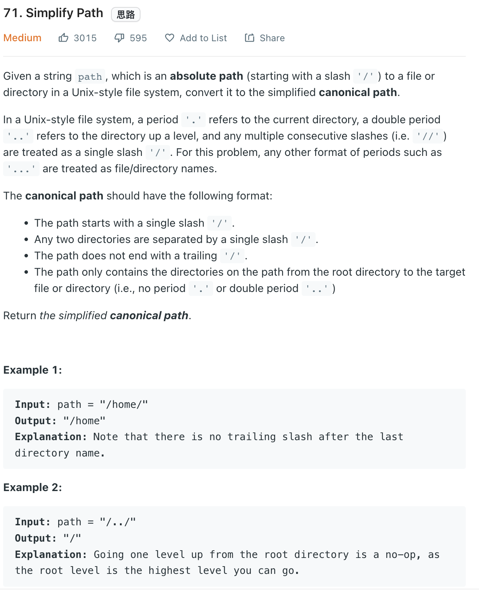

___
[71. Simplify Path](https://leetcode.com/problems/simplify-path/)
___

## 基本思路
* 啊啊啊啊啊啊啊啊啊啊
* 原本写了1个小时， 结果还是错的。 有太多edge case了
* 原来只需要`split('/')` 然后走一遍
* 如果遇到folder 名字的话， 就直接push into `stack`
* If meet `..` pop previous `folder`

___

`Time complexity : O(n)`

`Space complexity : O(1)`
```python
class Solution:
    def simplifyPath(self, path: str) -> str:
        stack = []
        for folder in path.split("/"):
            if folder == '.' or not folder:
                continue
                
            elif folder == "..":
                if stack:
                    stack.pop()
            else:
                stack.append(folder)
             
        return "/" + "/".join(stack)
```