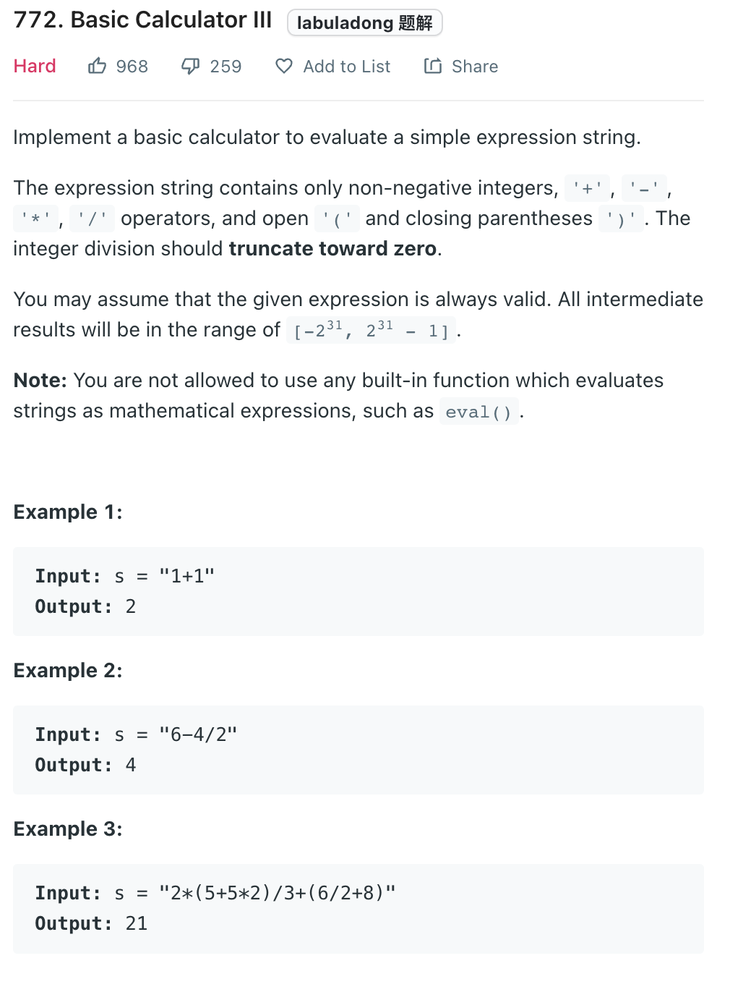
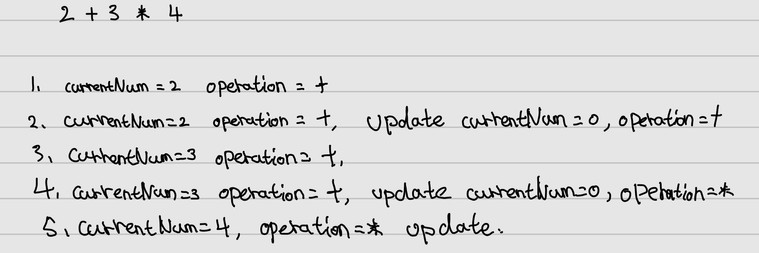

___
[772. Basic Calculator III](https://leetcode.com/problems/basic-calculator-iii/)
___

[224. Basic Calculator](https://leetcode.com/problems/basic-calculator/)
[227. Basic Calculator II](https://leetcode.com/problems/basic-calculator-ii/)

## 基本思路
* Above two questions are the same as this one.
* The import key is we do the layback calculate.
* For example the input is `2 + 3 * 4` the answer is 14
* We first set the `operation` to `+` because it's a `+2`
* Then next round when we see another operator, we push the `currentNum` into `stack`
* Now our stack contains a positive 2.
* Next round, our `currentNum` is `3`, and the `operation` is `+`, we push positive 3 into stack
* Next round, our `currentNum` is `4`, and the `operation` is `*`, we pop one from stack which is 3 and * `currentNum`
* 


___

`Time complexity : O(n)`

`Space complexity : O(n)`
```python
class Solution:
    def calculate(self, s: str) -> int:
        
        length = len(s)
        
        def dfs(index):
            
            def update():
                if operation == '+': stack.append(currentNum)
                if operation == '-': stack.append(-currentNum)
                if operation == '*': stack.append(stack.pop() * currentNum)
                if operation == '/': stack.append(int(stack.pop() / currentNum))
            
            operation, currentNum, stack = '+', 0, []
            
            while index < length:
                char = s[index]
                
                if char.isdigit():
                    currentNum = currentNum * 10 + int(char)
                if char in '+-*/':
                    update()
                    operation, currentNum = char, 0
                if char == '(':
                    currentNum, nextIndex = dfs(index + 1)
                    index = nextIndex
                if char == ')':
                    break
                index += 1
            
            update()
            return sum(stack), index
    
        return dfs(0)[0]
```