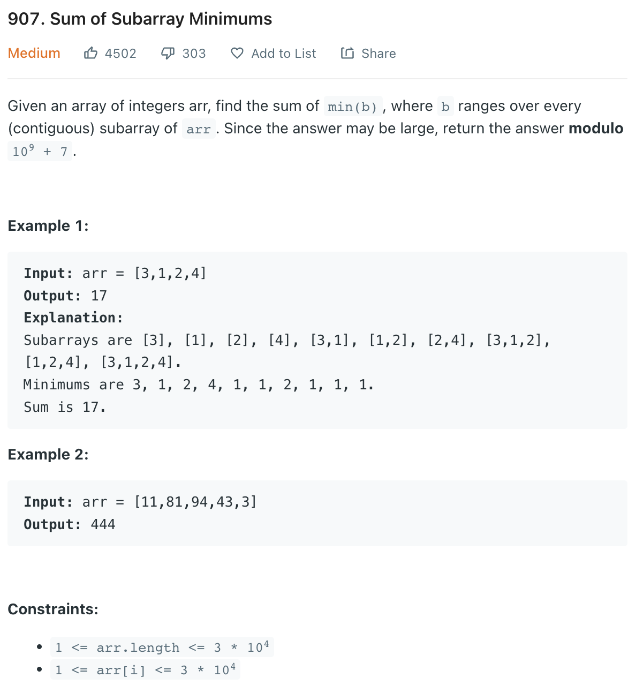
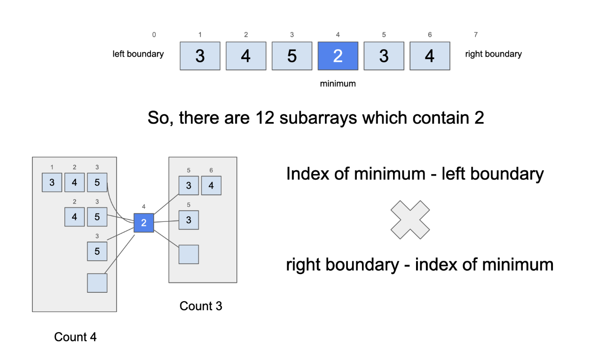

___
[907. Sum of Subarray Minimums](https://leetcode.com/problems/sum-of-subarray-minimums/)
___

## 基本思路
* This is a really hard question.
* The key point is use Monotonic Stack to store the previousSmallerIndex and nextSmallerIndex
* The stack is increasing order.
* The mid is the currentSmallestIndex from (previousSmallerIndex, nextSmallerIndex) exclusive
* The count is amazing
* 

___

`Time complexity : O(n)`

`Space complexity : O(n)`
```python
class Solution:
    def sumSubarrayMins(self, arr: List[int]) -> int:
        
        stack = []
        sumOfMin = 0
        for index in range(len(arr) + 1):
            while stack and (index == len(arr) or arr[stack[-1]] > arr[index]):
                currentSmallestIndex = stack.pop()
                previousSmallerIndex = -1 if not stack else stack[-1]
                nextSmallerIndex = index
                count = (currentSmallestIndex - previousSmallerIndex) * (nextSmallerIndex - currentSmallestIndex)
                sumOfMin += count * arr[currentSmallestIndex]
            
            stack.append(index)
            
        return sumOfMin % (10 ** 9 + 7)
```