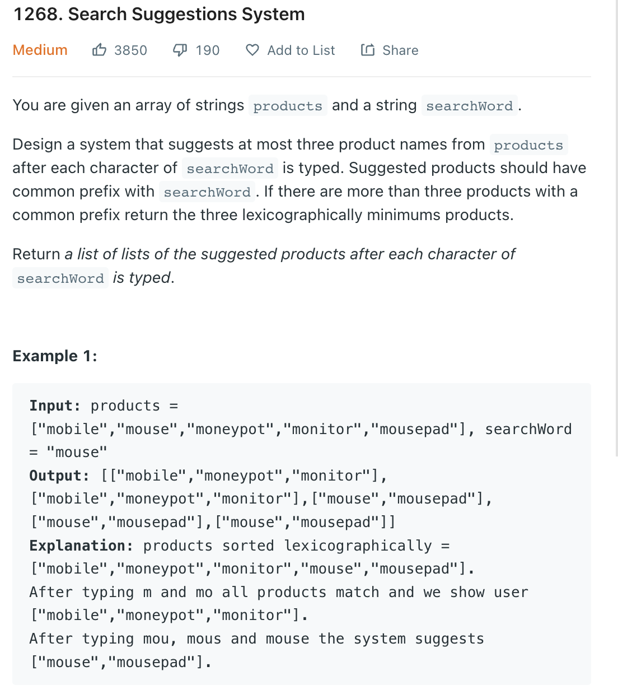

___
[1268. Search Suggestions System](https://leetcode.com/problems/search-suggestions-system/)
___


## 基本思路
* Build a Trie first.
* If the input is `mobile`
* Then we will try `m`, `mo`, `mob`.....
* Let's say current our input is `m`
* We first find the position of `m` in our Trie, then dfs check every possible solution `a-z`

___

`Time complexity : O(Total Characters in Products)`

`Space complexity : O(26n)`
```java
class Solution {
    public List<List<String>> suggestedProducts(String[] products, String searchWord) {
        Trie trie = new Trie();
        for (String product: products) {
            trie.insert(product);
        }
        
        List<List<String>> answer = new ArrayList<>();
        
        String prefix = "";
        for (char c: searchWord.toCharArray()) {
            prefix += c;
            answer.add(trie.startingWith(prefix));
        }
        return answer;
    }
}

class Trie {
    class TrieNode {
        boolean isWord = false;
        TrieNode[] children = new TrieNode[26];
        public TrieNode() {}
    }
    
    TrieNode root;
    
    public Trie() {
        root = new TrieNode();
    }
    
    public void insert(String s) {
        TrieNode current = root;
        for (char c: s.toCharArray()) {
            if (current.children[c - 'a'] == null) {
                current.children[c - 'a'] = new TrieNode();
            }
            current = current.children[c - 'a'];
        }
        current.isWord = true;
    }
    
    public List<String> startingWith(String s) {
        List<String> result = new ArrayList<>();
        TrieNode current = root;
        for (char c: s.toCharArray()) {
            if (current.children[c - 'a'] == null) {
                return result;
            }
            current = current.children[c - 'a'];
        }
        
        dfs(current, s, result);
        return result;
    }
    
    public void dfs(TrieNode current, String s, List<String> result) {
        if (result.size() == 3) {
            return;
        }
        if (current.isWord) {
            result.add(s);
        }
        for (char c = 'a'; c <= 'z'; c++) {
            if (current.children[c - 'a'] != null) {
                dfs(current.children[c - 'a'], s + c, result);
            }
        }
    } 
} 
```