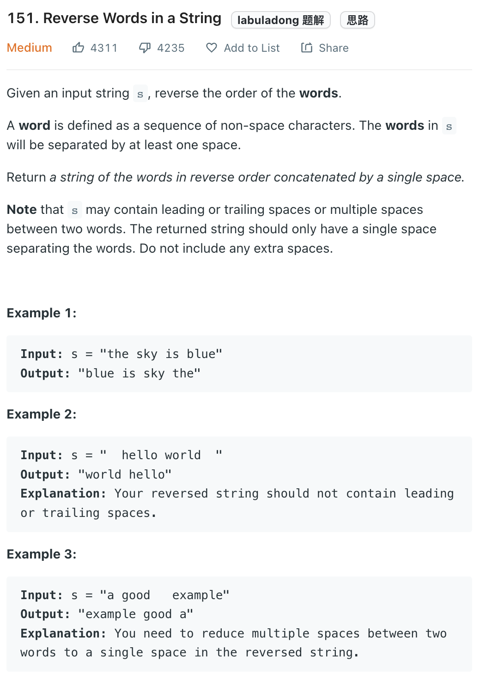

___
[151. Reverse Words in a String](https://leetcode.com/problems/reverse-words-in-a-string/)
___

## 基本思路
* ???

___

`Time complexity : O(n)`

`Space complexity : O(n)`
```python
class Solution:
    def reverseWords(self, s: str) -> str:
        s = s.strip()
        strList = s.split()         
        answer = ''
        
        for i in range(len(strList) - 1, -1, -1):
            answer = answer + ' ' + strList[i]
        return answer.strip()
```

___

```python
class Solution:
    def reverseWords(self, s: str) -> str:
        return " ".join(reversed(re.split("\\s+", s.strip(" "))))
```