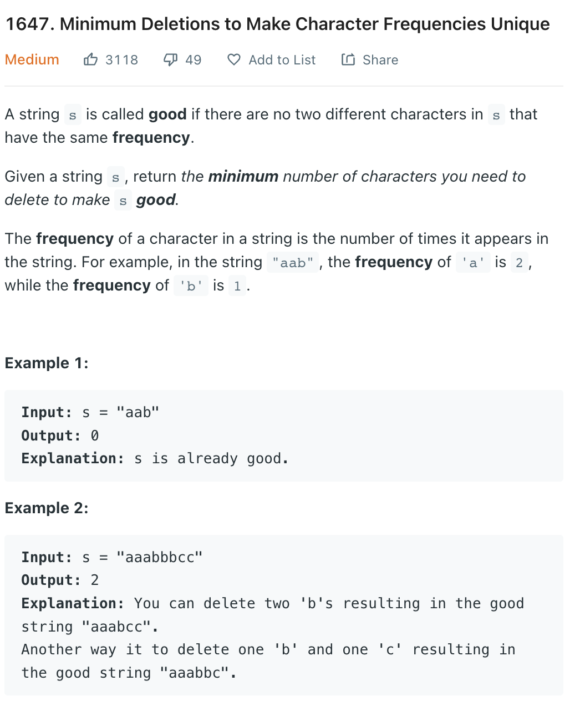

___
[1647. Minimum Deletions to Make Character Frequencies Unique](https://leetcode.com/problems/minimum-deletions-to-make-character-frequencies-unique/)
___

## 基本思路
* Find the frequency of each char first in desecding order.
* Then loop over and keep decreasing the frequency of the current character until it reaches a value that has not appeared before.

___

`N is the length of the given string, and K is the maximum possible number of distinct characters in s.`
`Time complexity : O(N + K^2)`

`Space complexity : O(K)`
```python
class Solution:
    def minDeletions(self, s: str) -> int:
        frequency = [k[1] for k in collections.Counter(s).items()]
        frequency.sort(reverse=True)
        answer = 0
        
        nums = set()
        
        for count in frequency:
            temp = count
            while temp and temp in nums:
                temp -= 1
                answer += 1
            nums.add(temp)
        
        return answer
```