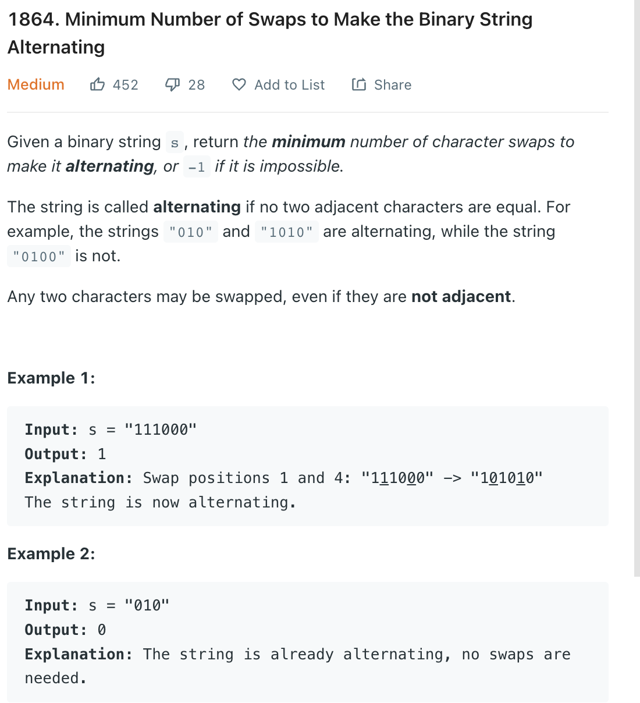

___
[1864. Minimum Number of Swaps to Make the Binary String Alternating](https://leetcode.com/problems/minimum-number-of-swaps-to-make-the-binary-string-alternating/)
___

## 基本思路
* The easiest way of solving this problem is count the misposition.
* For example our input is: 
* `11100`
* The correct solution is `10101` because there are more ones than zeros

* If our input is: `11000`
* The correct solution is `01010` becuase there are more zeros than ones
  
* If our input is `100101`
* The correct solutions are `010101` or `101010`
* But since we are returnning the minimum moves, so the correct answer is `010101`

___

`Time complexity : O(n)`

`Space complexity : O(1)`
```python
class Solution:
    def minSwaps(self, s: str) -> int:
        counts = collections.Counter(s)
        
        countOnes = counts['1']
        countZeros = counts['0']
        length = len(s)
        
        if abs(countOnes - countZeros) > 1:
            return -1
        
        if countOnes > countZeros:
            return self.helper(s, '1')
        elif countZeros > countOnes:
            return self.helper(s, '0')
        else:
            return min(self.helper(s, '1'), self.helper(s, '0'))
    
    def helper(self, s, c):
        counts = 0
        
        for ch in s:
            if ch != c:
                counts += 1
            
            if c == '1':
                c = '0'
            else:
                c = '1'
        
        print(counts)
        return counts // 2
        
```