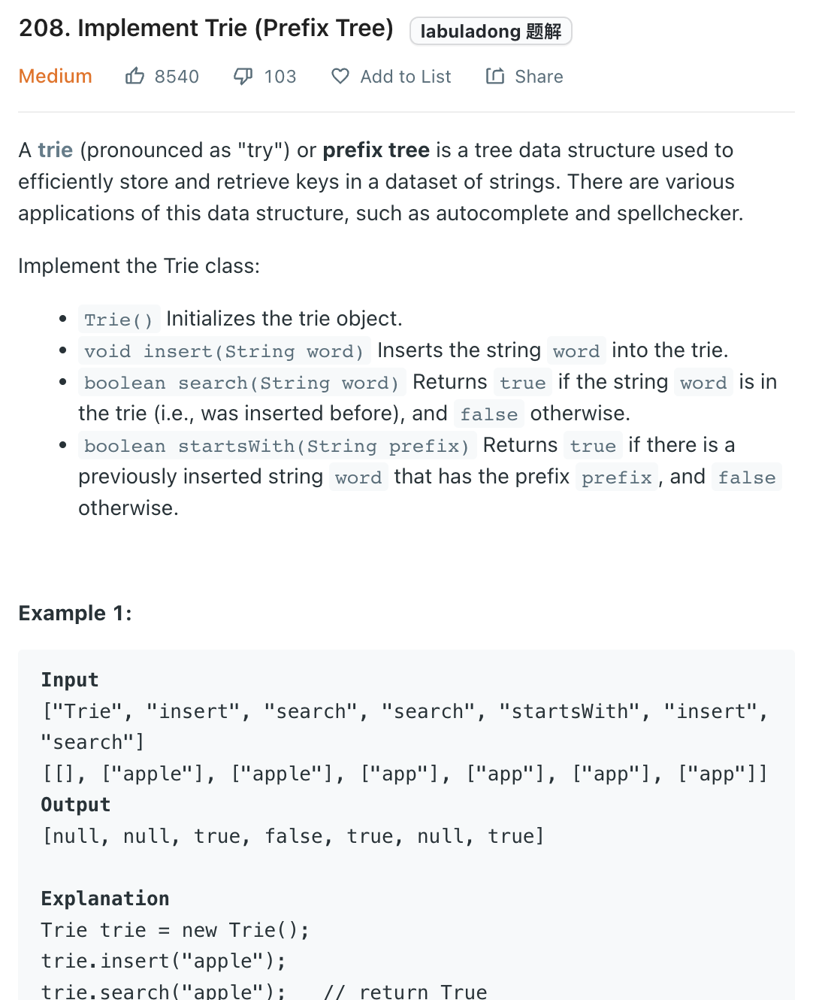

___
[208. Implement Trie (Prefix Tree)](https://leetcode.com/problems/implement-trie-prefix-tree/)
___


## 基本思路
* Build a Trie, we need to have TrieNode,
* TrieNode contains `isWord` and `TrieNode[26]`

___

`Time complexity : O(len(word))`

`Space complexity : O(26n)`
```java
class TrieNode {
    public boolean isWord; 
    public TrieNode[] children = new TrieNode[26];
    public TrieNode() {}
}

class Trie {

    private TrieNode root;
    
    public Trie() {
        root = new TrieNode();    
    }
    
    public void insert(String word) {
        TrieNode current = root;
        
        for (char c: word.toCharArray()) {
            if (current.children[c - 'a'] == null) {
                current.children[c - 'a'] = new TrieNode();
            }
            current = current.children[c - 'a'];
        }
        current.isWord = true;
    }
    
    public boolean search(String word) {
        TrieNode current = root;
        
        for (char c: word.toCharArray()) {
            if (current.children[c - 'a'] == null) {
                return false;
            }
            current = current.children[c - 'a'];
        }
        
        return current.isWord;
    }
    
    public boolean startsWith(String prefix) {
        TrieNode current = root;
        
        for (char c: prefix.toCharArray()) {
            if (current.children[c - 'a'] == null) {
                return false;
            }
            current = current.children[c - 'a'];
        }
        
        return true;
    }
}
```