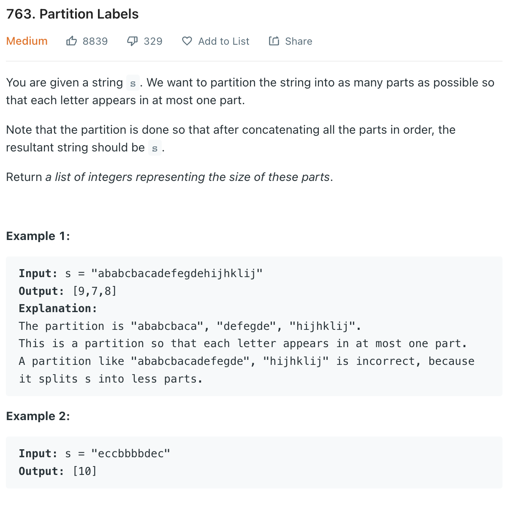

___
[763. Partition Labels](https://leetcode.com/problems/partition-labels/)
___

## 基本思路
* Use HashMap to store the last index of each char.
* Having a variable to store the current maxIndex.
* Go over the string, for each char,
* If the current index have reach maxIndex, we keep moving forward.
* If the current index == maxIndex, we add into our answer.
* Update maxIndex each time.

___

`Time complexity : O(n)`

`Space complexity : O(n)`
```python
class Solution:
    def partitionLabels(self, s: str) -> List[int]:
        length = len(s)
        dic = {}
        for i in range(length):
            dic[s[i]] = i
        
        currentMax = dic[s[0]]
        currentLength = 0
        answer = []
        
        i = 0
        while i < length:
            char = s[i]
            if i == currentMax:
                answer.append(i + 1 - currentLength)
                currentLength = i + 1
                if i + 1 < length:
                    currentMax = dic[s[i + 1]]
                
            currentMax = max(currentMax, dic[char])
            i += 1

        return answer
```