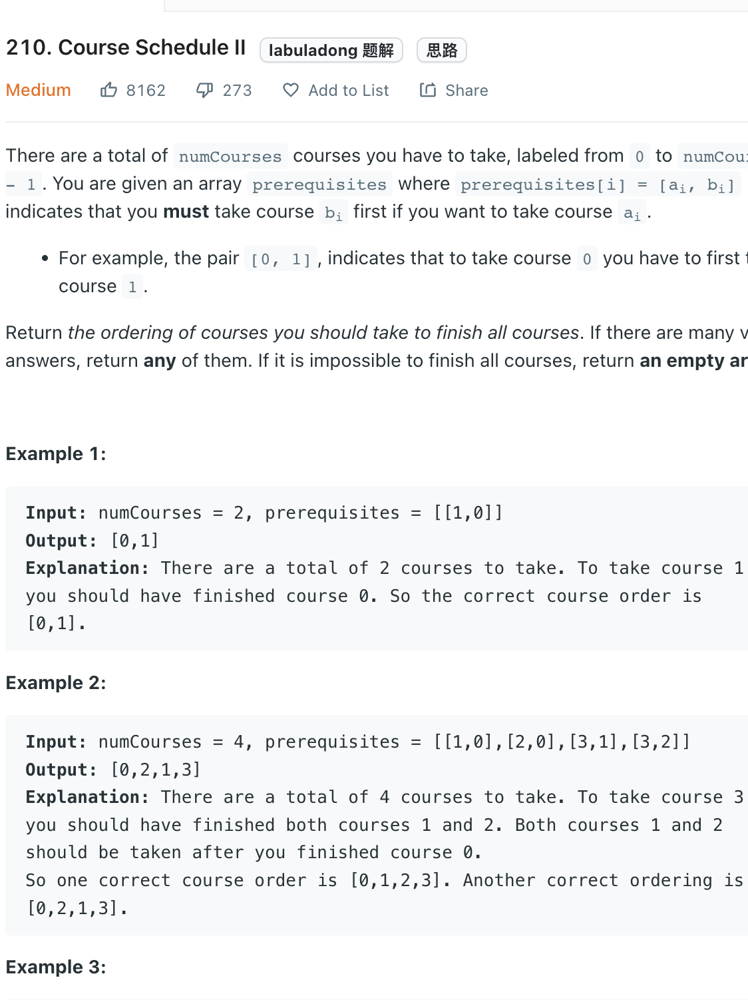
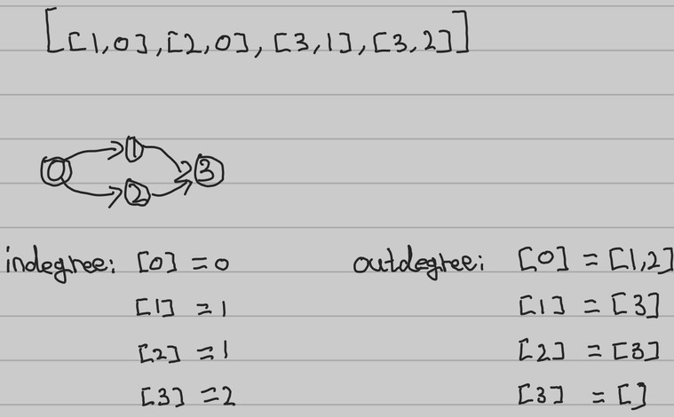

___
[210. Course Schedule II](https://leetcode.com/problems/course-schedule-ii/)
___

## 分析问题
* By converting this question into a graph question is going to easy for us.

## 基本思路

* Inorder to take a course, we need to make sure there are no any pre_course for this course.
* So how do we found out the courses that don't have any pre_courses?
* Think each course is a node in a graph.
* A node(course) may have some indegree(pre_courses) and some outdegree(courses you can learn after finish this course)
* We create a queue that only contains 0 indegree nodes(courses don't need pre_courses), because those nodes are guarantee we can finish.
* After we finish a node(course), what are the courses you may able to learn after you finish this course.
* If we found out a course have no indegree, append into the queue and loop the process.

___

V == number of Vertices
E == number of Edges
`Time complexity : O(V + E)`

`Space complexity : O(V + E)`
```python
    def findOrder(self, numCourses: int, prerequisites: List[List[int]]) -> List[int]:
        
        in_degree = {}
        out_degree = {}
        answer = []
        
        for course, pre_course in prerequisites:
            in_degree[course] = in_degree.get(course, 0) + 1
        
            if pre_course not in out_degree:
                out_degree[pre_course] = []
            out_degree[pre_course].append(course)
        
        queue = collections.deque([k for k in range(numCourses) if k not in in_degree])
        
        while queue:
            current_course = queue.popleft()
            answer.append(current_course)
            if current_course not in out_degree:
                continue
            for learning_course in out_degree[current_course]:
                in_degree[learning_course] -= 1
                if in_degree[learning_course] == 0:
                    queue.append(learning_course)
        
        return answer if len(answer) == numCourses else []
```