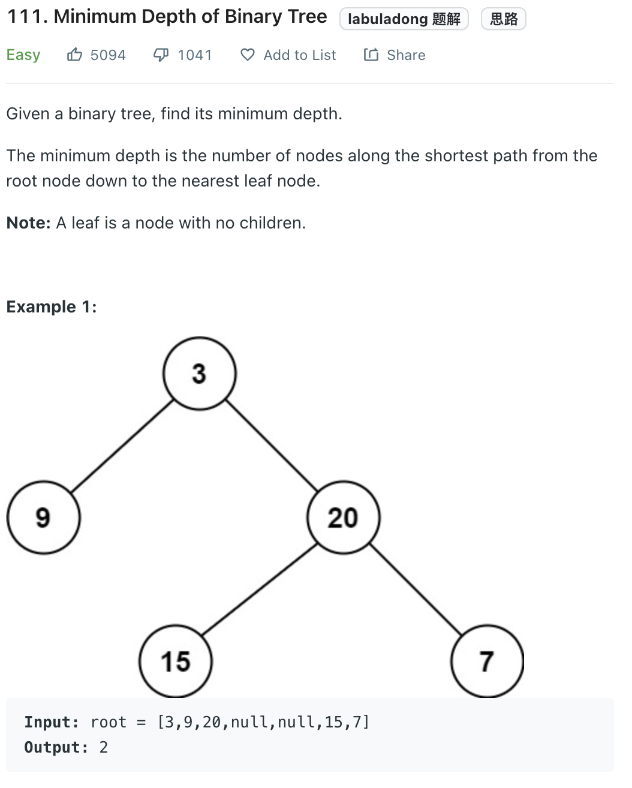

___
[111. Minimum Depth of Binary Tree](https://leetcode.com/problems/minimum-depth-of-binary-tree/)
___

## 分析问题
* 

## 基本思路
* 

___

`Time complexity : O()`

`Space complexity : O()`
```python
class Solution:
    def minDepth(self, root: Optional[TreeNode]) -> int:
        if not root:
            return 0
        
        def dfs(root):
            if not root:
                return float('inf')
            if not root.left and not root.right:
                return 1
            
            left = 1 + dfs(root.left)
            right = 1 + dfs(root.right)
            minPath = min(left, right)
            return minPath
        
        return dfs(root)
```

___

```python
class Solution:
    def minDepth(self, root: Optional[TreeNode]) -> int:
        
        if not root:
            return 0
        
        queue = collections.deque()
        queue.append(root)
        depth = 0
        while queue:
            depth += 1
            for _ in range(len(queue)):
                root = queue.popleft()
                if not root.left and not root.right:
                    return depth
                if root.left:
                    queue.append(root.left)
                if root.right:
                    queue.append(root.right)
        return depth
```