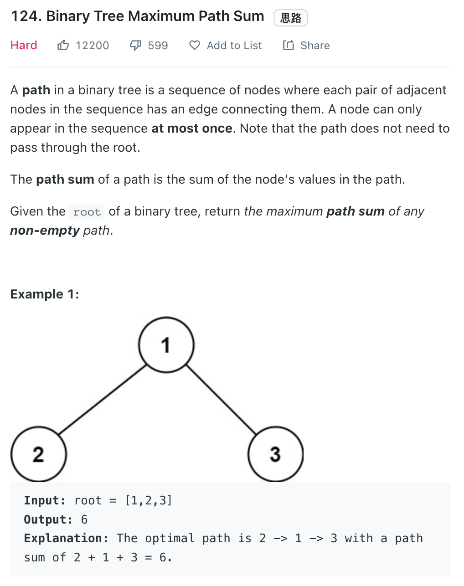

___
[124. Binary Tree Maximum Path Sum](https://leetcode.com/problems/binary-tree-maximum-path-sum/)
___

## 基本思路
* 

___

`Time complexity : O(n)`

`Space complexity : O(1)`
```python
class Solution:
    def maxPathSum(self, root: Optional[TreeNode]) -> int:
        maxSum = -float('inf')
        
        def dfs(root):
            nonlocal maxSum
            if not root:
                return 0
            
            left = max(0, dfs(root.left))
            right = max(0, dfs(root.right))
            
            maxSum = max(maxSum, left + right + root.val)
            
            return root.val + max(left, right)
        
        dfs(root)
        return maxSum
```