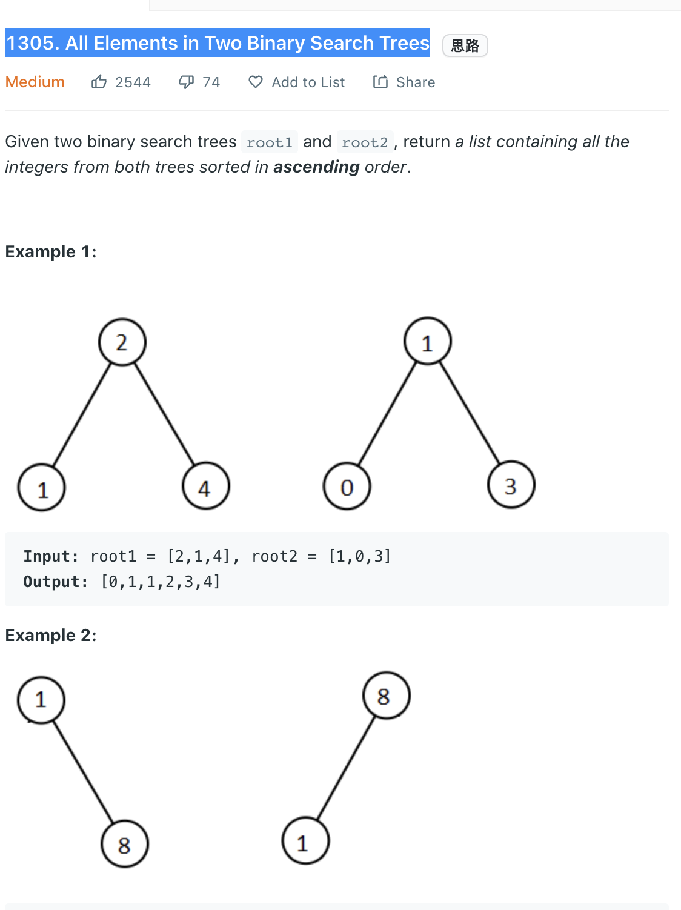

___
[1305. All Elements in Two Binary Search Trees](https://leetcode.com/problems/all-elements-in-two-binary-search-trees/)
___

## 分析问题
* The easy way of solving this question is inorder traversal of two trees and convert into a list. Then sort this list. 
* But it requires a lot of memory usage and quit slow.

## 基本思路
* Using BSTIterator.
* BSTIterator uses stack to mimic inorder traversal.
* It's guarantee the smallest element is the next element.
* The smallest element of a BST is always the left most sub-tree and then the right sub-tree.
* Stack is first in last out
* Within those properties. If we push the left most sub-tree into `stack`, the peek is return us the smallest element. 
* The second smallest element is guarantee in the right sub-tree (Maybe the right element itself, or the right sub-tree is a brand new tree).

* Within BSTIterator, we can compare the value one by one and insert into our `answer` list. 

___

`Time complexity : O()`

`Space complexity : O()`
```java
class Solution {
    public List<Integer> getAllElements(TreeNode root1, TreeNode root2) {
        BSTIterator tree1 = new BSTIterator(root1);
        BSTIterator tree2 = new BSTIterator(root2);
        List<Integer> answer = new ArrayList<>();
        while (!tree1.isEmpty() && !tree2.isEmpty()) {
            if (tree1.peek() < tree2.peek()) {
                answer.add(tree1.next());
            } else {
                answer.add(tree2.next());
            }
        }
        while (!tree1.isEmpty()) {
            answer.add(tree1.next());
        }
        while (!tree2.isEmpty()) {
            answer.add(tree2.next());
        }
        return answer;
    }
}

class BSTIterator {
    Stack<TreeNode> stack = new Stack<>();
    
    public BSTIterator(TreeNode root) {
        pushLeftBranch(root);
    }
    
    private void pushLeftBranch(TreeNode root) {
        while (root != null) {
            stack.push(root);
            root = root.left;
        }
    }
    
    public int next() {
        TreeNode root = stack.pop();
        pushLeftBranch(root.right);
        return root.val;
    }
    
    public int peek() {
        return stack.peek().val;
    }
    
    public boolean isEmpty() {
        return stack.isEmpty();
    }
}
```