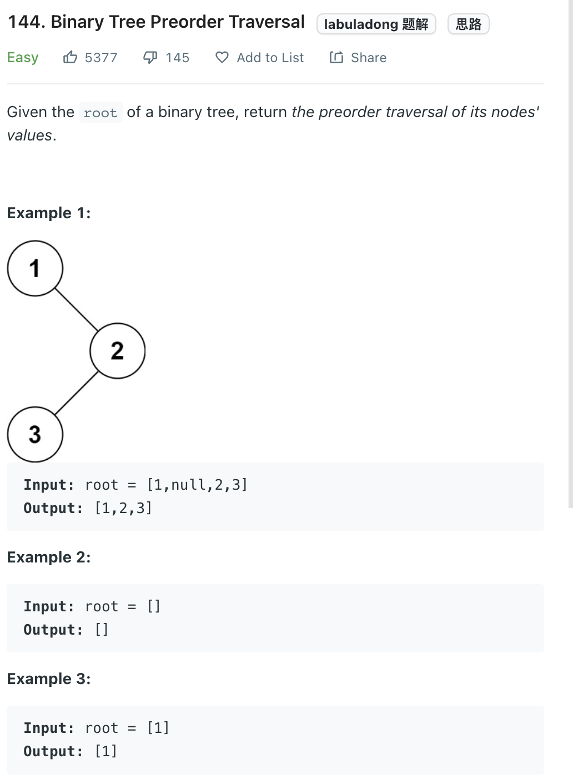

___
[144. Binary Tree Preorder Traversal](https://leetcode.com/problems/binary-tree-preorder-traversal/)
___

## 分析问题
* 

## 基本思路
* 

___

`Time complexity : O(n)`

`Space complexity : O(n)`
```python
class Solution:
    def preorderTraversal(self, root: Optional[TreeNode]) -> List[int]:
        answer = []
        stack = []
        stack.append(root)
        
        while stack:
            root = stack.pop()
            
            if root is not None:
                answer.append(root.val)
                if root.right is not None:
                    stack.append(root.right)
                if root.left is not None:
                    stack.append(root.left)
                
        return answer
```