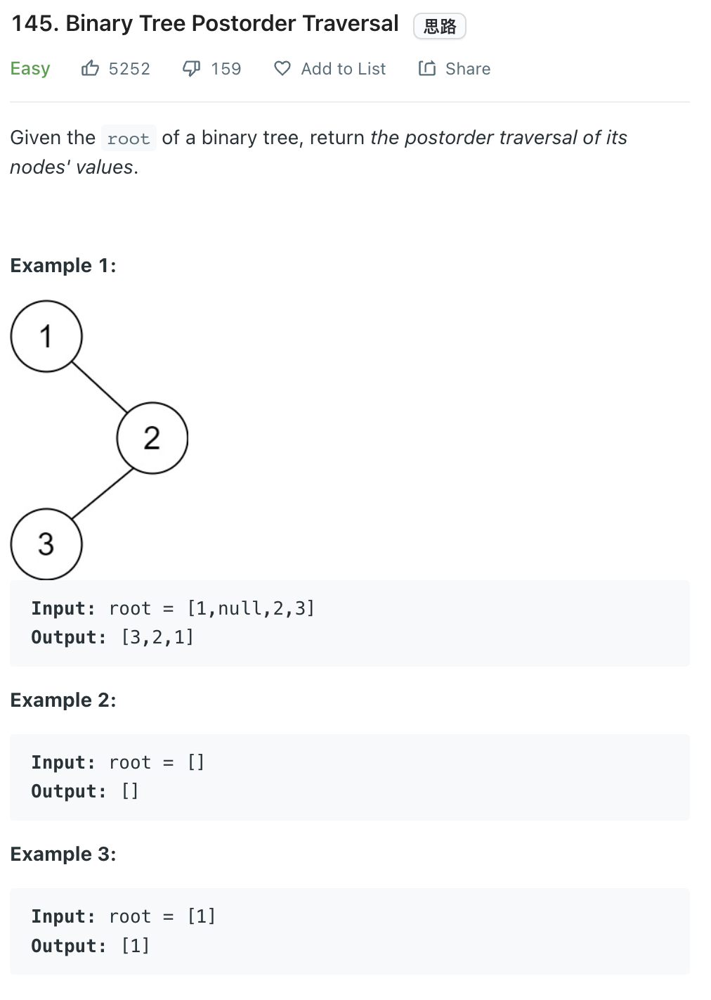

___
[145. Binary Tree Postorder Traversal](https://leetcode.com/problems/binary-tree-postorder-traversal/)
___

## 分析问题
* 

## 基本思路
* 

___

`Time complexity : O(n)`

`Space complexity : O(n)`
```python
class Solution:
    def postorderTraversal(self, root: Optional[TreeNode]) -> List[int]:
        linkedList = []
        stack = []
        
        stack.append(root)
        
        while stack and root:
            root = stack.pop()
            linkedList.insert(0, root.val)
            if root.left:
                stack.append(root.left)
            if root.right:
                stack.append(root.right)
            
        return linkedList
```