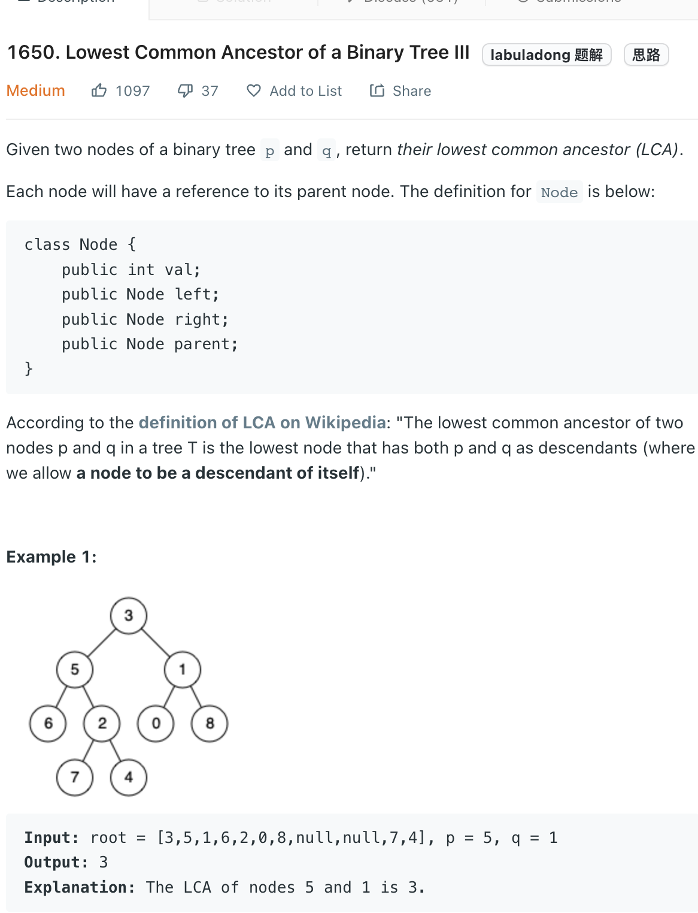

___
[1650. Lowest Common Ancestor of a Binary Tree III](https://leetcode.com/problems/lowest-common-ancestor-of-a-binary-tree-iii/)
___

## 分析问题
* There are better solution use only O(h) space, but i too lazy to learn it.

## 基本思路
* There are 3 situations
* 1. The ancestor is the root, `p` is root.left or right and `q` is root.left or right
* 2. `p` is the ancestor
* 3. `q` is the ancestor
* put `p`'s parent into `set`
* Then put `q`'s parent into `set`
* If they have common ancestor, it will must be the lowest common ancestor
* Base on above 3 situations, we can easily find the answer

___

`Time complexity : O(h)`

`Space complexity : O(h)`
```python
    def lowestCommonAncestor(self, p: 'Node', q: 'Node') -> 'Node':
        parent_set = set()
        current = p
        
        while current:
            parent_set.add(current)
            current = current.parent
            
        current = q
        
        while current:
            if current in parent_set:
                return current
            current = current.parent
            
        return None
```