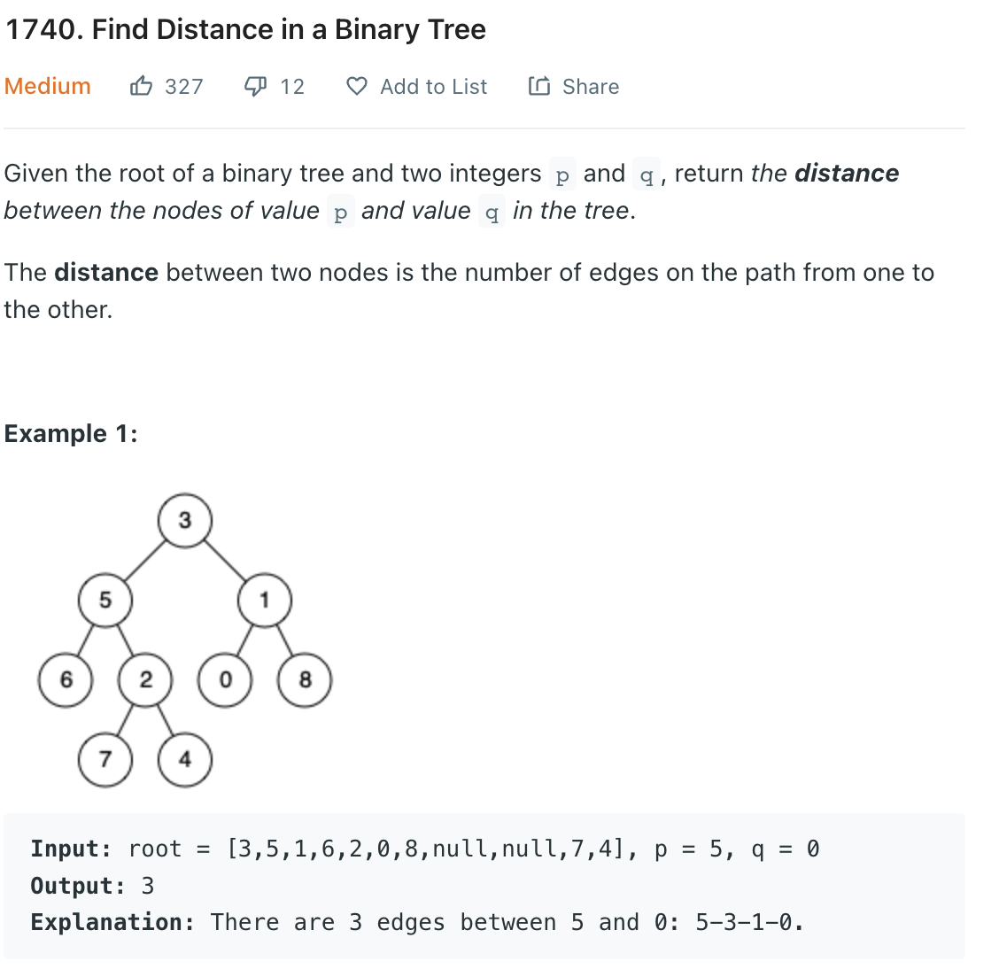

___
[1740. Find Distance in a Binary Tree](https://leetcode.com/problems/find-distance-in-a-binary-tree/)
___

## 基本思路
* Same as [2096. Step-By-Step Directions From a Binary Tree Node to Another](https://github.com/longlonglu/shuati/blob/main/tree/2096.%20Step-By-Step%20Directions%20From%20a%20Binary%20Tree%20Node%20to%20Another/2096.%20Step-By-Step%20Directions%20From%20a%20Binary%20Tree%20Node%20to%20Another.md)

___

`Time complexity : O(n)`

`Space complexity : O(h)`
```python
# Definition for a binary tree node.
# class TreeNode:
#     def __init__(self, val=0, left=None, right=None):
#         self.val = val
#         self.left = left
#         self.right = right
class Solution:
    def findDistance(self, root: Optional[TreeNode], p: int, q: int) -> int:
        
        pPath = []
        qPath = []
        
        def dfs(root, path):
            nonlocal pPath, qPath
            if not root:
                return
            if root.val == p:
                pPath = collections.deque(path)
            if root.val == q:
                qPath = collections.deque(path)
            
            path.append("L")
            dfs(root.left, path)
            path.pop()
            
            path.append('R')
            dfs(root.right, path)
            path.pop()
            
        dfs(root, [])
        while pPath and qPath and pPath[0] == qPath[0]:
            pPath.popleft()
            qPath.popleft()
        return len(pPath) + len(qPath)
```