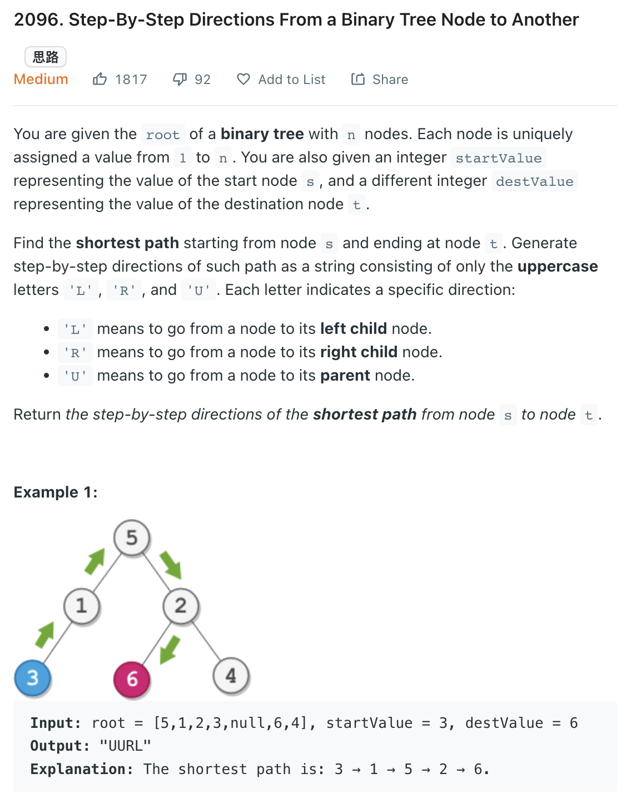

___
[2096. Step-By-Step Directions From a Binary Tree Node to Another](https://leetcode.com/problems/step-by-step-directions-from-a-binary-tree-node-to-another/)
___


## 基本思路
* 这题的思路比较巧妙，主要分三步：

1、分别记录从根节点到 startValue 和 destValue 的路径 startPath 和 destPath。

2、然后去除 startPath 和 destPath 的公共前缀。

3、最后将 startPath 全部变成 U，把 startPath 和 destPath 接在一起，就是题目要求的路径了。

___

`Time complexity : O(n)`

`Space complexity : O(h)`
```python
class Solution:
    def getDirections(self, root: Optional[TreeNode], startValue: int, destValue: int) -> str:
        startPath = ""
        destPath = ""
        
        def dfs(root, path):
            nonlocal startPath, destPath
            if not root:
                return
            
            if root.val == startValue:
                startPath = collections.deque(path)
            if root.val == destValue:
                destPath = collections.deque(path)
                
            path.append('L')
            dfs(root.left, path)
            path.pop()
            
            path.append('R')
            dfs(root.right, path)
            path.pop()
        
        dfs(root, [])
        
        while startPath and destPath and startPath[0] == destPath[0]:
            startPath.popleft()
            destPath.popleft()
        return 'U' * len(startPath) + ''.join(destPath)
```