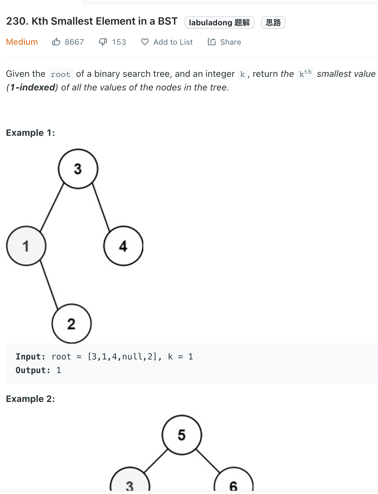

___
[230. Kth Smallest Element in a BST](https://leetcode.com/problems/kth-smallest-element-in-a-bst/)
___


## 基本思路
* It's same as [1305. All Elements in Two Binary Search Trees](https://github.com/longlonglu/shuati/blob/main/tree/1305.%20All%20Elements%20in%20Two%20Binary%20Search%20Trees/1305.%20All%20Elements%20in%20Two%20Binary%20Search%20Trees.md)

___

`Time complexity : O(h)`

`Space complexity : O(h)`
```java
/**
 * Definition for a binary tree node.
 * public class TreeNode {
 *     int val;
 *     TreeNode left;
 *     TreeNode right;
 *     TreeNode() {}
 *     TreeNode(int val) { this.val = val; }
 *     TreeNode(int val, TreeNode left, TreeNode right) {
 *         this.val = val;
 *         this.left = left;
 *         this.right = right;
 *     }
 * }
 */
class Solution {
    public int kthSmallest(TreeNode root, int k) {
        BSTIterator iterator = new BSTIterator(root);
        int answer = -1;
        while (k > 0) {
            answer = iterator.pop().val;
            k--;
        }
        return answer;
    }
}

class BSTIterator {
    Stack<TreeNode> stack;
    
    private void push(TreeNode root) {
        while (root != null) {
            stack.push(root);
            root = root.left;
        }
    }
    
    public BSTIterator(TreeNode root) {
        stack = new Stack<>();
        push(root);
    }
    
    public TreeNode pop() {
        if (stack.isEmpty()) { return null; }
        TreeNode root = stack.pop();
        push(root.right);
        return root;
    }
    
    public TreeNode peek() {
        if (stack.isEmpty()) { return null; }
        return stack.peek();
    }
}
```