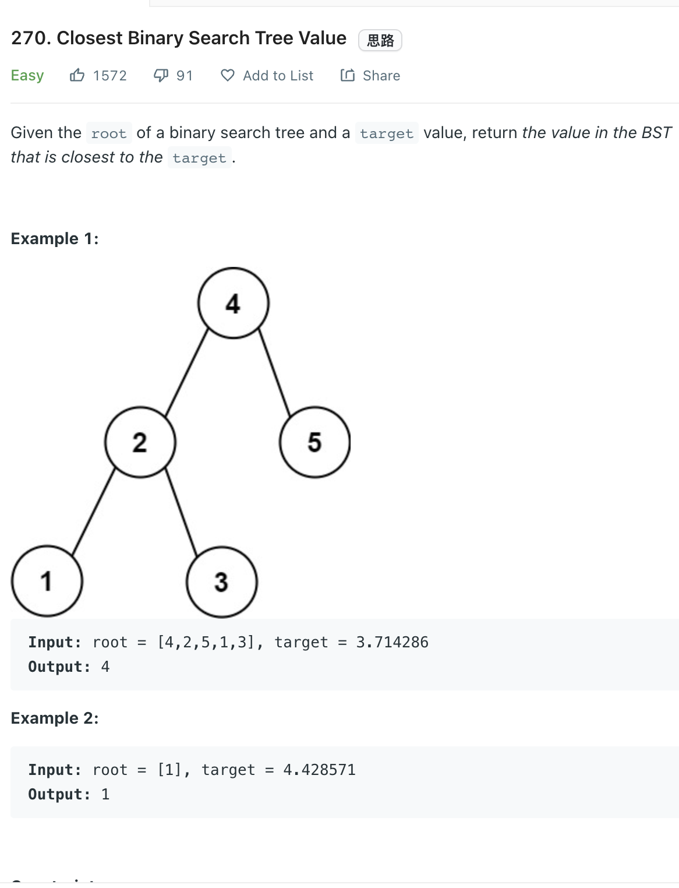

___
[270. Closest Binary Search Tree Value](https://leetcode.com/problems/closest-binary-search-tree-value/)
___

## 基本思路
* We can use recursion or iterative.
* Both are pretty straight forward

___

`Time complexity : O(long(n))`

`Space complexity : O(1)`
```python
    def closestValue(self, root: Optional[TreeNode], target: float) -> int:
        
        closest = float('inf')
        answer = None
        
        def dfs(root):
            nonlocal closest
            nonlocal answer
            
            if not root:
                return
            
            if abs(target - root.val) < closest:
                answer = root
                closest = abs(target - root.val)
            
            if root.val < target:
                dfs(root.right)
            else:
                dfs(root.left)
            
        dfs(root)
        return answer.val
```

___

```java
class Solution {
    public int closestValue(TreeNode root, double target) {
        double closest = Math.abs(root.val - target);
        int answer = 0;
        
        while (root != null) {
            if (Math.abs(root.val - target) <= closest) {
                closest = Math.abs(root.val - target);
                answer = root.val;
            }
            if (root.val < target) {
                root = root.right;
            } else {
                root = root.left;
            }
        }
        return answer;
    }
}
```