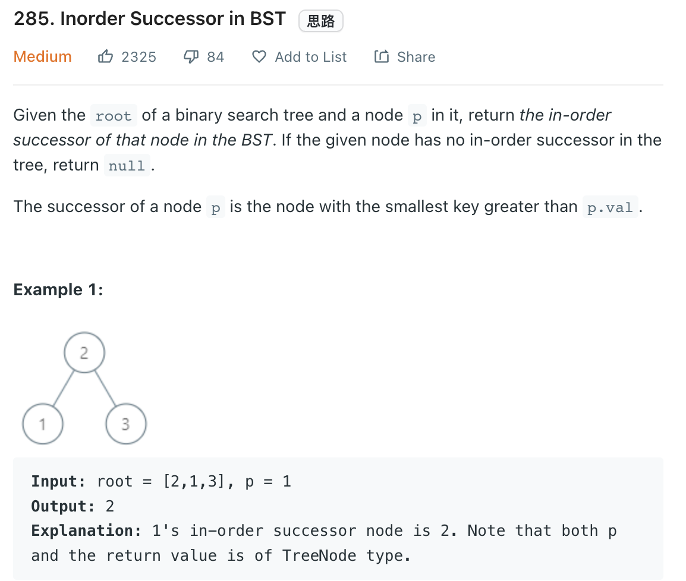

___
[285. Inorder Successor in BST](https://leetcode.com/problems/inorder-successor-in-bst/)
___


## 基本思路
* Inorder traversal means we need to do some logic after we finish the left sub-tree.
* There are 3 possibel answers, `None`, `root` or `next smallest element greater than current node`
* For `None` answer, that means the given node is the last element of the tree of inorder traversal.
* For `root` answer, that means the given node is at the `root.left`
* For `next smallest element greater than current node` answer
* That means the given node is at `right` and we need to find the next smallest element greater than given node.

___

`Time complexity : O(log(n))`

`Space complexity : O(1)`
```python
class Solution:
    def inorderSuccessor(self, root: TreeNode, p: TreeNode) -> Optional[TreeNode]:
        if not root:
            return None
        
        successor = None
        
        if root.val == p.val:
            return self.getMin(root.right)
        
        if root.val > p.val:
            successor = self.inorderSuccessor(root.left, p)
            if not successor:
                return root
        else:
            successor = self.inorderSuccessor(root.right, p)

        return successor
        
    def getMin(self, root):
        while root and root.left:
            root = root.left
        return root
```