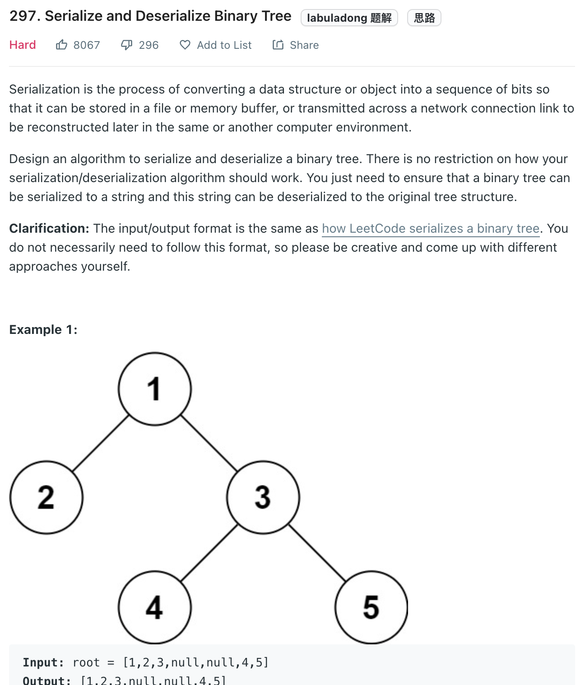

___
[297. Serialize and Deserialize Binary Tree](https://leetcode.com/problems/serialize-and-deserialize-binary-tree/)
___

## 基本思路
* preorder traversal convert a tree to string.
* Convert the string into queue.
* Preorder tranversal convert a queue to tree

___

`Time complexity : O(n)`

`Space complexity : O(n)`
```java
/**
 * Definition for a binary tree node.
 * public class TreeNode {
 *     int val;
 *     TreeNode left;
 *     TreeNode right;
 *     TreeNode(int x) { val = x; }
 * }
 */
public class Codec {

    // Encodes a tree to a single string.
    public String serialize(TreeNode root) {
        StringBuilder sb = new StringBuilder();
        buildString(sb, root);
        System.out.println(sb.substring(0, sb.length() - 1).toString());
        return sb.substring(0, sb.length() - 1).toString();
    }
    
    public void buildString(StringBuilder sb, TreeNode root) {
        if (root == null) {
            sb.append("null,");
            return;
        }
        sb.append(root.val + ",");
        buildString(sb, root.left);
        buildString(sb, root.right);
    }

    // Decodes your encoded data to tree.
    public TreeNode deserialize(String data) {
        Queue<String> queue = new LinkedList<>(Arrays.asList(data.split(",")));
        return buildTree(queue);
    }
    
    public TreeNode buildTree(Queue<String> queue) {
        if (queue.size() == 0) { return null; }
        String node = queue.poll();
        if (node.equals("null")) { return null; }
        TreeNode root = new TreeNode(Integer.parseInt(node));
        
        root.left = buildTree(queue);
        root.right = buildTree(queue);
        return root;
    }
}

// Your Codec object will be instantiated and called as such:
// Codec ser = new Codec();
// Codec deser = new Codec();
// TreeNode ans = deser.deserialize(ser.serialize(root));
```