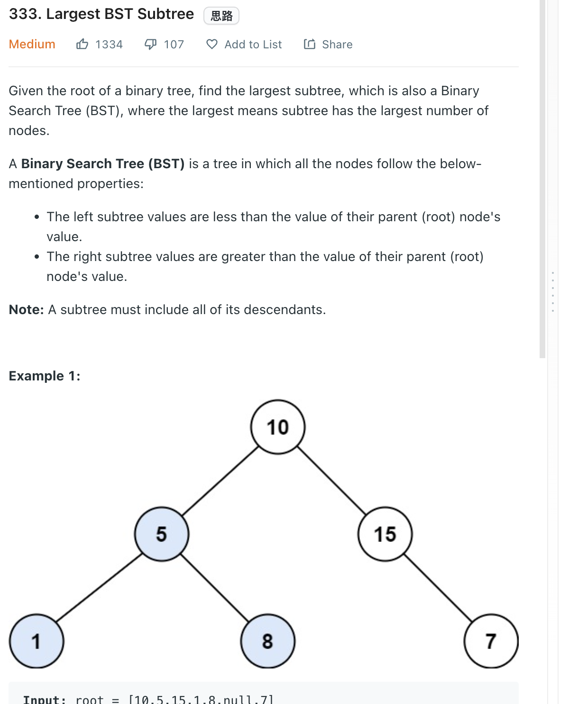

___
[333. Largest BST Subtree](https://leetcode.com/problems/largest-bst-subtree/)
___


## 基本思路
* Same as [98. Validate Binary Search Tree](https://github.com/longlonglu/shuati/blob/main/tree/98.%20Validate%20Binary%20Search%20Tree/98.%20Validate%20Binary%20Search%20Tree.md) 
* There is a better solution, but i a dumb ass now Nov 6 2022

___

`Time complexity : O(N^2)`

`Space complexity : O(h)`
```java
class Solution {
    public int largestBSTSubtree(TreeNode root) {
        if (root == null) {
            return 0;
        }
        int numOfValidNodes = validBST(root);
        if (numOfValidNodes > 0) {
            return numOfValidNodes;
        }
        return Math.max(largestBSTSubtree(root.left), largestBSTSubtree(root.right));
    }
    
    public int validBST(TreeNode root) {
        Deque<TreeNode> stack = new ArrayDeque<>();
        Integer previous = null;
        int counter = 0;
        while(!stack.isEmpty() || root != null) {
            while (root != null) {
                stack.push(root);
                root = root.left;
            }
            
            root = stack.pop();
            
            if (previous != null && root.val <= previous) {
                return -1;
            }
            previous = root.val;
            root = root.right;
            counter++;
        }
        return counter;
    }
}
```