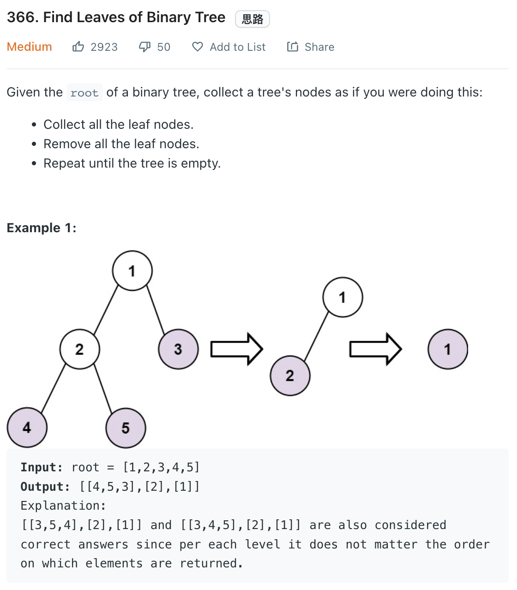

___
[366. Find Leaves of Binary Tree](https://leetcode.com/problems/find-leaves-of-binary-tree/)
___


## 基本思路
* There are two ways of solving this question.
* 1. If we find a leaf, we make is to Null and add the answer.
* 2. We continue this process until the `root` is Null

* Another better way is using O(n) time complexity.
* The idea is to find the height of each node backward.
* We do the post-order to find the height of each node.
* At first round, the real leaves will be at level 0.
* Next round, the height of their parent is the `max(leftHeight, rightHeight) + 1`
* In this way, we can store the value of level leaves into correct index.

___

`Time complexity : O()`

`Space complexity : O()`
```python
class Solution:
    def findLeaves(self, root: Optional[TreeNode]) -> List[List[int]]:
        answer = []
        
        def dfs(root, leaves):
            if not root:
                return None
            if not root.left and not root.right:
                leaves.append(root.val)
                return None
            root.left = dfs(root.left, leaves)
            root.right = dfs(root.right, leaves)
            return root
        
        while root:
            leaves = []
            root = dfs(root, leaves)
            answer.append(leaves)
        return answer
```

___

```python
class Solution:
    def findLeaves(self, root: Optional[TreeNode]) -> List[List[int]]:
        answer = []
        
        def dfs(root):
            if not root:
                return -1
            
            left = dfs(root.left)
            right = dfs(root.right)
            
            currentHeight = max(left, right) + 1
            
            if currentHeight == len(answer):
                answer.append([])
            answer[currentHeight].append(root.val)
            return currentHeight
        
        dfs(root)
        return answer
```