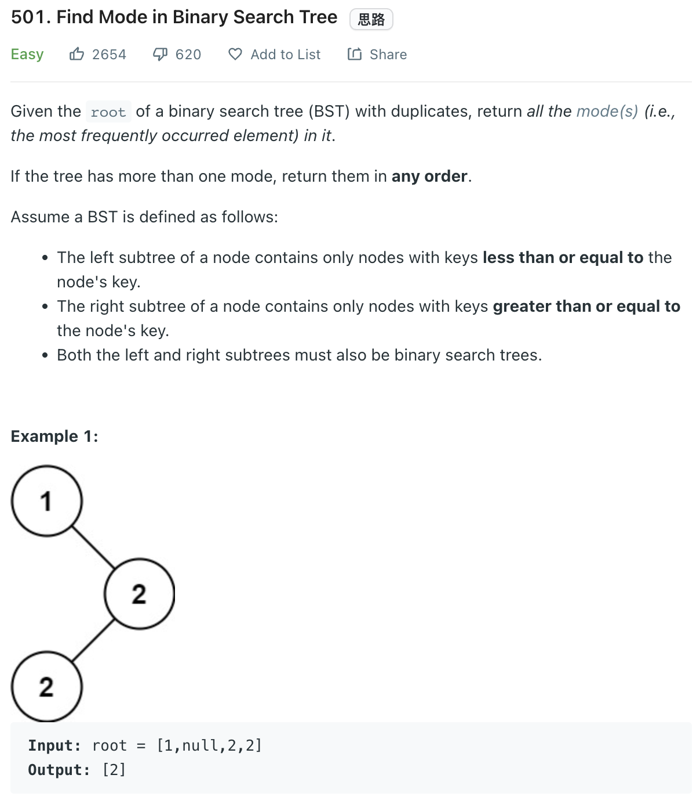

___
[501. Find Mode in Binary Search Tree](https://leetcode.com/problems/find-mode-in-binary-search-tree/)
___


## 基本思路
* Inorder traversal of a BST will return us the sorted list.
* Have a previousNode is really important.
* We will also need a `count` and `maxCountn` to check weather should we keep this solution or refresh our solution

___

`Time complexity : O(n)`

`Space complexity : O(1)`
```python
class Solution:
    def findMode(self, root: Optional[TreeNode]) -> List[int]:
        previous = None
        count = 0
        maxCount = 0
        answer = []
        
        def dfs(root):
            nonlocal previous, count, maxCount, answer
            if not root:
                return
            
            dfs(root.left)
            
            if not previous or previous.val != root.val:
                count = 1
            else:
                count += 1  
                
            if count == maxCount:
                answer.append(root.val)
                
            if count > maxCount:
                answer.clear()
                answer.append(root.val)
                maxCount = count
               
            previous = root
            dfs(root.right)
        dfs(root)
        return answer
```