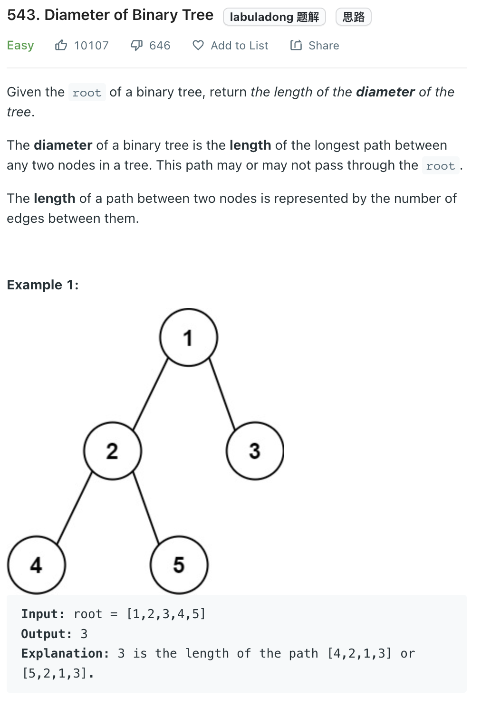

___
[543. Diameter of Binary Tree](https://leetcode.com/problems/diameter-of-binary-tree/)
___


## 基本思路
* Find the max depth of both left and right, meanwhile calculate the answer

___

`Time complexity : O(n)`

`Space complexity : O(1)`
```python
class Solution:
    def diameterOfBinaryTree(self, root: Optional[TreeNode]) -> int:
        diameter = 0
        
        def longest_path(root):
            if not root:
                return 0
            
            nonlocal diameter
            left = longest_path(root.left)
            right = longest_path(root.right)
            
            diameter = max(diameter, left + right)
            
            return max(left, right) + 1
        
        longest_path(root)
        return diameter
```