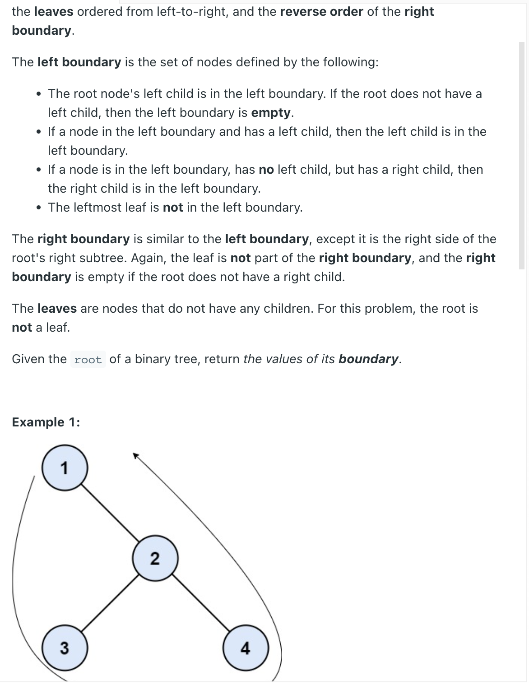

___
[545. Boundary of Binary Tree](https://leetcode.com/problems/boundary-of-binary-tree/)
___

## 基本思路
* Solving in one recursion is really hard, but if we can seprate it, it will become easy.
* Left Boundary first
* Then Left Leaves
* Then Right Leaves
* Then Right Boundary

___

`Time complexity : O()`

`Space complexity : O()`
```python
# Definition for a binary tree node.
# class TreeNode:
#     def __init__(self, val=0, left=None, right=None):
#         self.val = val
#         self.left = left
#         self.right = right
class Solution:
    def boundaryOfBinaryTree(self, root: Optional[TreeNode]) -> List[int]:
        self.answer = []
        self.answer.append(root.val)
        
        self.leftBoundary(root.left)
        self.leaves(root.left)
        self.leaves(root.right)
        self.rightBoundary(root.right)
        
        return self.answer    
    
    
    def leftBoundary(self, root):
        if not root or (not root.left and not root.right):
            return
        self.answer.append(root.val)
        if not root.left:
            self.leftBoundary(root.right)
        else:
            self.leftBoundary(root.left)
    
    def rightBoundary(self, root):
        if not root or (not root.left and not root.right):
            return
        if not root.right:
            self.rightBoundary(root.left)
        else:
            self.rightBoundary(root.right)
        self.answer.append(root.val)
        
    def leaves(self, root):
        if not root:
            return
        if not root.left and not root.right:
            self.answer.append(root.val)
        self.leaves(root.left)
        self.leaves(root.right)
        
```