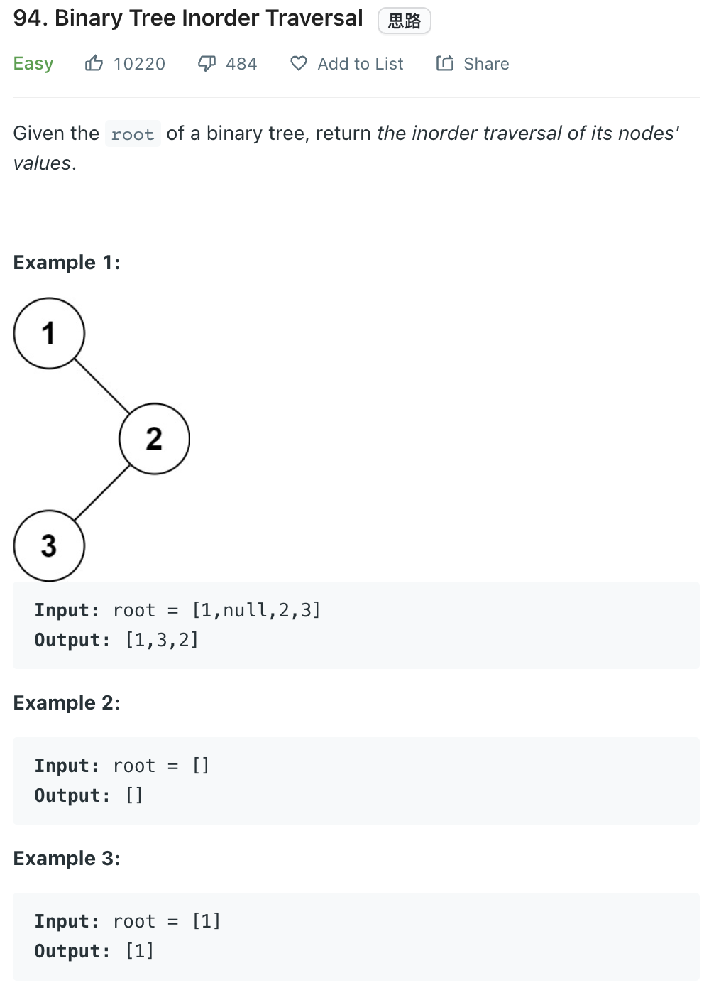

___
[94. Binary Tree Inorder Traversal](https://leetcode.com/problems/binary-tree-inorder-traversal/)
___

## 分析问题
* 

## 基本思路
* 

___

`Time complexity : O(n)`

`Space complexity : O(n)`
```python
class Solution:
    def inorderTraversal(self, root: Optional[TreeNode]) -> List[int]:
        answer = []
        stack = []
        def appendLeft(node):
            while node:
                stack.append(node)
                node = node.left
        
        appendLeft(root)
        while stack:
            root = stack.pop()
            answer.append(root.val)
            if root.right:
                appendLeft(root.right)
                
        return answer
```