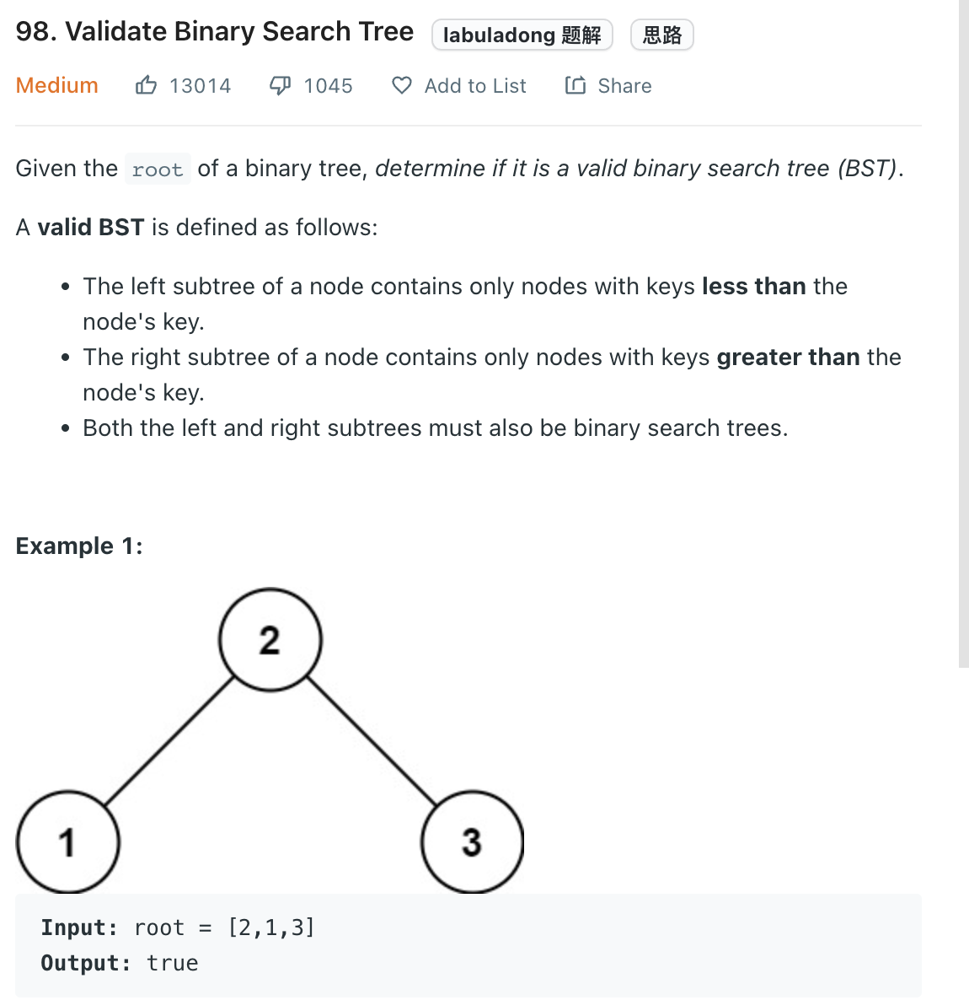

___
[98. Validate Binary Search Tree](https://leetcode.com/problems/validate-binary-search-tree/)
___


## 基本思路
* This way, we are using a global variable.
* The key point is we need to know previous node while we are inorder travering the tree
* Current node must be <= than previous node.

___

`Time complexity : O(n)`

`Space complexity : O(1)`
```python
class Solution:
    def isValidBST(self, root: Optional[TreeNode]) -> bool:
        
        def dfs(root):
            if not root:
                return True
            
            left = dfs(root.left)
            if self.previous_node and root.val <= self.previous_node.val:
                return False
            
            self.previous_node = root
            
            right = dfs(root.right)
    
            return left and right
    
        self.previous_node = None
        return dfs(root)
        
```
___


## 基本思路
* We are using Iterative inorder traversal
* We also store the previous node and compare with current node

```java
class Solution {
    public boolean isValidBST(TreeNode root) {
        Deque<TreeNode> stack = new ArrayDeque<>();
        Integer previous = null;
        
        while (!stack.isEmpty() || root != null) {
            while (root != null) {
                stack.push(root);
                root = root.left;
            }
            root = stack.pop();
            if (previous != null && root.val <= previous) {
                return false;
            }
            previous = root.val;
            root = root.right;
        }
        return true;
    }
}
```