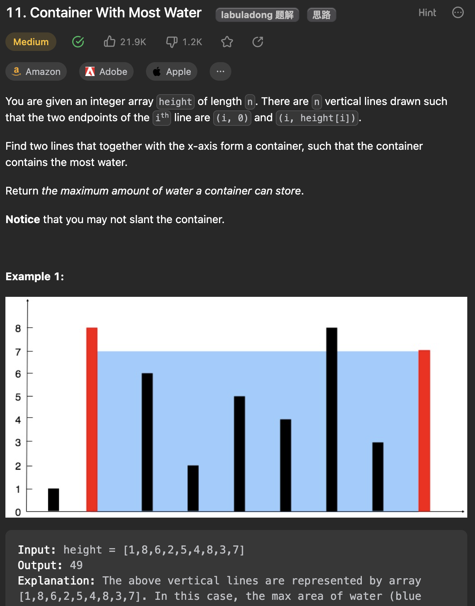

___
[11. Container With Most Water](https://leetcode.com/problems/container-with-most-water/description/)
___

## 基本思路
* Acturally, we only need to have two pointers merge from right, left to the middle.
* If the height[right] > height[left] we move left pointer.

___

`Time complexity : O(n)`

`Space complexity : O(1)`
```python
class Solution:
    def maxArea(self, height: List[int]) -> int:
        left, right = 0, len(height) - 1
        maxArea = 0

        while left < right:
            maxArea = max((right - left) * min(height[right], height[left]), maxArea)
            if height[left] >= height[right]:
                right -= 1
            else:
                left += 1

        return maxArea
```