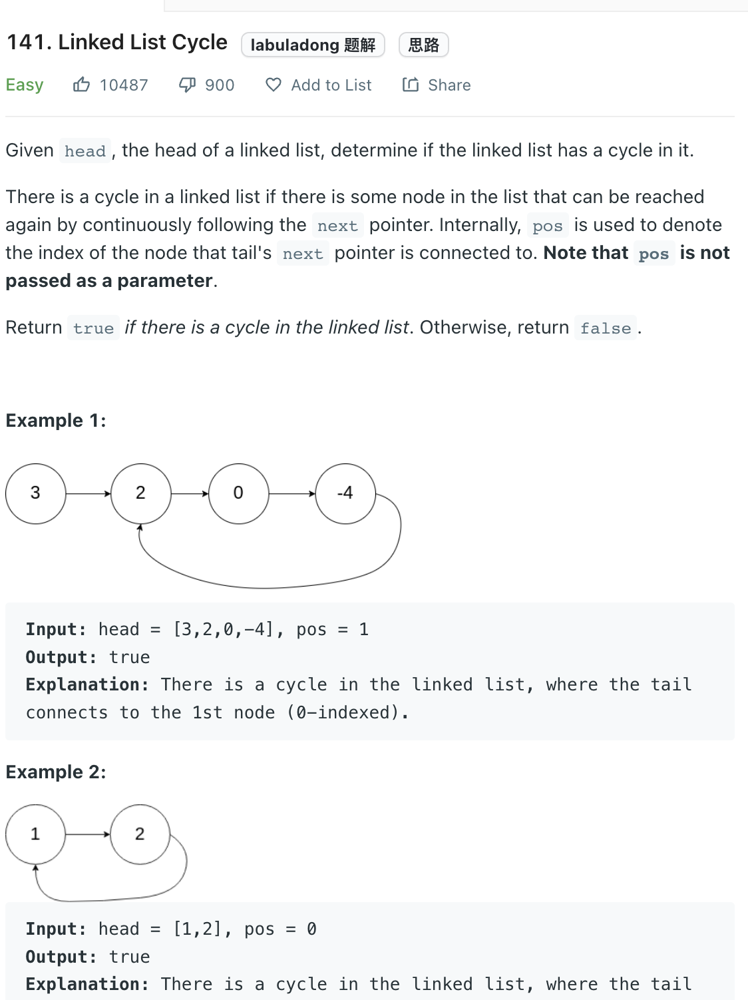

___
[141. Linked List Cycle](https://leetcode.com/problems/linked-list-cycle/)
___

## 分析问题
* We can use a set to check, but it requires extra space
* Floyd's Cycle Finding Algorithm is better

## 基本思路
* Having two pointers `slow` and `fast`
* `slow` take 1 step and `fast` take 2 steps  each loop
* If there exists cycle, `slow` will meet `fast`, else they are going end of the list and return `False`
* 
___

`Time complexity : O(n)`

`Space complexity : O(1)`
```python
    def hasCycle(self, head: Optional[ListNode]) -> bool:
        if head is None:
            return False
        slow, fast = head, head.next
        
        while fast and fast.next not in [None]:
            if slow == fast:
                return True
            slow = slow.next
            fast = fast.next.next
        
        return False
```