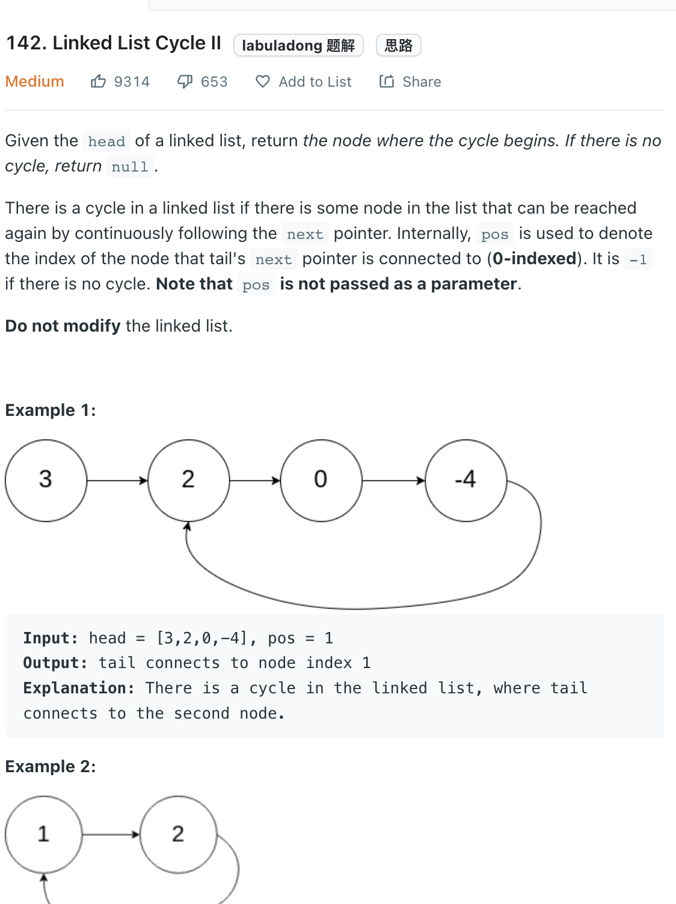

___
[142. Linked List Cycle II](https://leetcode.com/problems/linked-list-cycle-ii/)
___

## 分析问题
* Set is ok but need extra memory
* Floyd's Tortoise and Hare is handsome, but hard to understand

## 基本思路
* 死记硬背
* Having two pointers `slow` and `fast`
* `slow` take 1 step and `fast` take 2 steps  each loop
* Once they meet. Make a new pointer start from head and goes 1 step per loop, same at `slow `pointer, the answer will be when `slow` and new pointer meet

___

`Time complexity : O(n)`

`Space complexity : O(1)`
```python
    def detectCycle(self, head: Optional[ListNode]) -> Optional[ListNode]:
        slow, fast = head, head
        
        while fast and fast.next:
            slow = slow.next
            fast = fast.next.next
            if slow == fast:
                while head != slow:
                    head = head.next
                    slow = slow.next
                return head
            
        return None
```