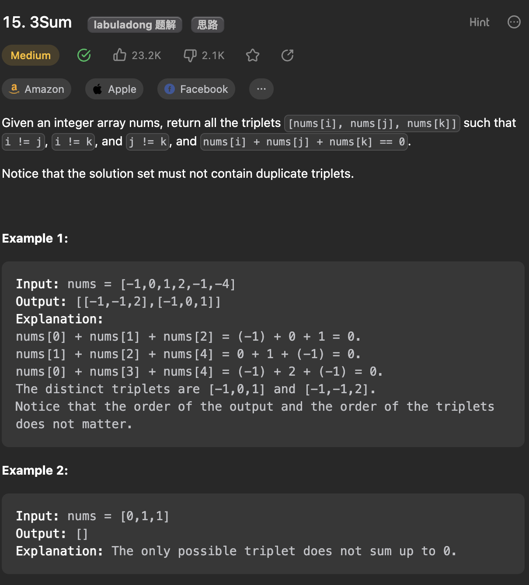

___
[15. 3Sum](https://leetcode.com/problems/3sum/description/)
___


## 基本思路
* The key point is avoid duplicates.
* We sort first, becuase this can speed up while we move forward.
* We pick `firstNum`, then pick `secondNum` and `thirdNum` while to moving forward.
* If the total sum is < 0, then we know we need to move our `secondNum`
* To avoid duplicates, if current num is equal to previous one, we continue

___

`Time complexity : O(nlog(n))`

`Space complexity : O(1)`
```python
class Solution:
    def threeSum(self, nums: List[int]) -> List[List[int]]:
        nums.sort()
        answer = []

        for i in range(len(nums)):
            if i > 0 and nums[i] == nums[i - 1]:
                continue
            firstNum = nums[i]
            left, right = i + 1, len(nums) - 1

            while left < right:
                secondNum = nums[left]
                thirdNum = nums[right]
                total = firstNum + secondNum + thirdNum
                if total == 0:
                    answer.append([firstNum, secondNum, thirdNum])
                    left += 1
                    right -= 1
                    while left < right and nums[left] == nums[left - 1]:
                        left += 1
                    while left < right and nums[right] == nums[right + 1]:
                        right -= 1
                elif total < 0:
                    left += 1
                else:
                    right -= 1

        return answer
```