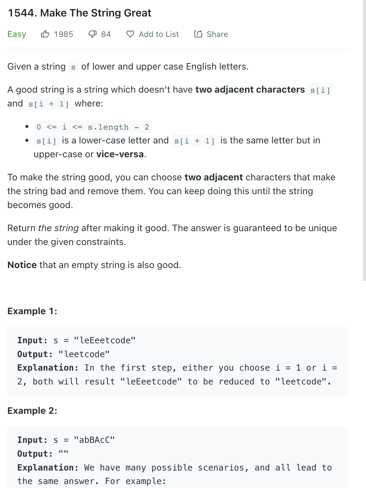

___
[1544. Make The String Great](https://leetcode.com/problems/make-the-string-great/)
___


## 基本思路
* Using `Stack` is kind of easy, but not fancy
* Two Pointers requires more skill but same idea with `stack` approch
* We create a new StringBuilder (easy to delete)
* If current char in `s` is `same` as last char in `sb`, remove that char in `sb`

___

`Time complexity : O(n^2)`

`Space complexity : O(n)`
```java
class Solution {
    public String makeGood(String s) {
        StringBuilder sb = new StringBuilder();
        
        int right = 0;
        while (right < s.length()) {
            if (sb.length() > 0 && Math.abs(sb.charAt(sb.length() - 1) - s.charAt(right)) == 32) {
                sb.deleteCharAt(sb.length() - 1);
            } else {
                sb.append(s.charAt(right));
            }
            right++;
        }
        
        return sb.toString();
    }
}
```