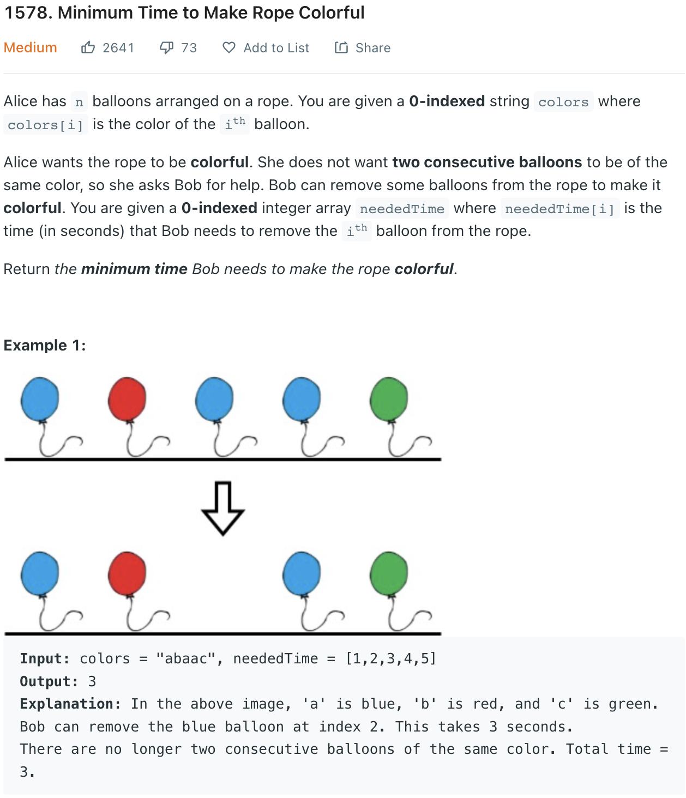

___
[1578. Minimum Time to Make Rope Colorful](https://leetcode.com/problems/minimum-time-to-make-rope-colorful/)
___


## 基本思路
* Nothing special, a normal Two Pointer
* Find the `totalTime` and `maxTime` for each group

___

`Time complexity : O(n)`

`Space complexity : O(1)`
```python
class Solution:
    def minCost(self, colors: str, neededTime: List[int]) -> int:
        answer = 0
        index = 0
        while index < len(colors):
            currentChar = colors[index]
            totalTime = 0
            maxTime = 0
            while index < len(colors):
                if currentChar == colors[index]:
                    totalTime += neededTime[index]
                    maxTime = max(maxTime, neededTime[index])
                    index += 1
                else:
                    index -= 1
                    break
            answer += totalTime - maxTime
            index += 1
        return answer
```