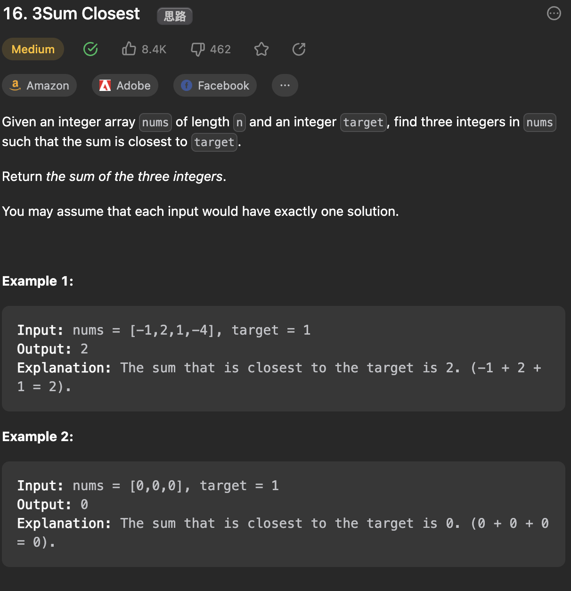

___
[16. 3Sum Closest](https://leetcode.com/problems/3sum-closest/description/)
___


## 基本思路
* The Key is to find the abslote closest.
* `abs(firstNum + secondNum + thirdNum - target) == currentClosest`

___

`Time complexity : O(nlog(n))`

`Space complexity : O(1)`
```python
class Solution:
    def threeSumClosest(self, nums: List[int], target: int) -> int:
        nums.sort()
        currentClosest, answer = float('inf'), 0

        for i in range(len(nums)):
            firstNum = nums[i]
            left, right = i + 1, len(nums) - 1

            while left < right:
                secondNum = nums[left]
                thirdNum = nums[right]
                total = firstNum + secondNum + thirdNum
                if currentClosest > abs(total - target):
                    answer = total
                    currentClosest = abs(total - target)
                if total == target:
                    return target
                if total < target:
                    left += 1
                else:
                    right -= 1
        
        return answer
```