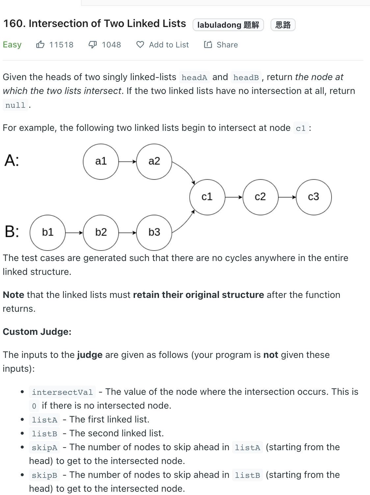
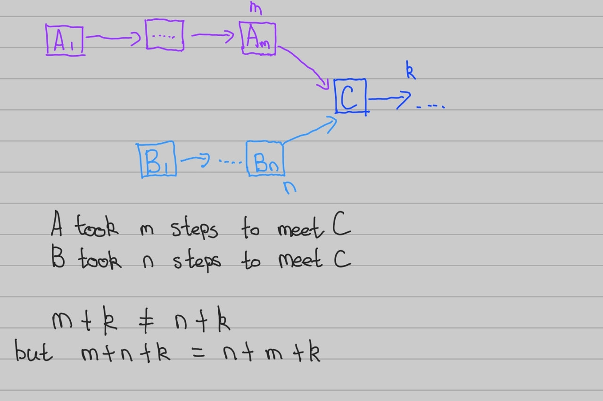

___
[160. Intersection of Two Linked Lists](https://leetcode.com/problems/intersection-of-two-linked-lists/)
___

## 分析问题
* We need to control the movement of 2 pointers

## 基本思路

* Link to list logiclly together
* If `listA` ends, relink to `headB`

___

`Time complexity : O(n)`

`Space complexity : O(1)`
```python
    def getIntersectionNode(self, headA: ListNode, headB: ListNode) -> Optional[ListNode]:
        p1, p2 = headA, headB
        
        while p1 != p2:
            p1 = p1.next if p1 else headB
            p2 = p2.next if p2 else headA
        
        return p1
```