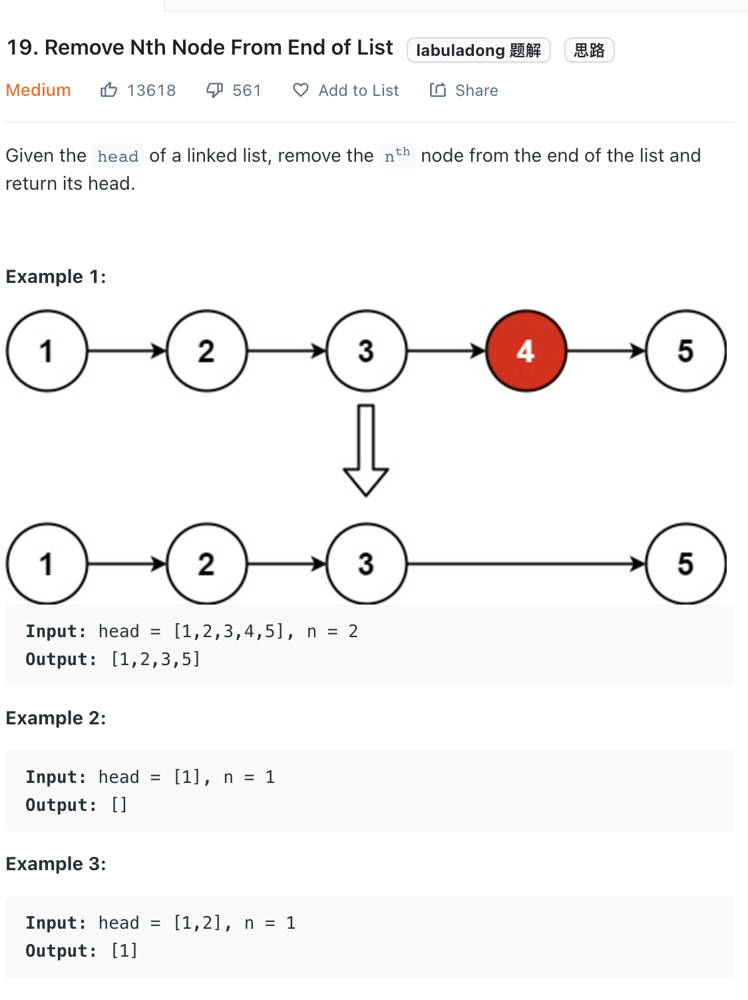

___
[19. Remove Nth Node From End of List](https://leetcode.com/problems/remove-nth-node-from-end-of-list/)
___

## 分析问题
* We can find out the length of list first and then remove the node, but it require two passes.
* Instead of using two passes, we can use two pointers and one pass

## 基本思路
* Having a pointer called `fast` that traval `n` step ahead of `slow` pointer.
* Then both pointer move sync
* If `fast` reach the end of list, when mean `slow` is Nth node form the end of list
* Because the distance between `fast` and `slow` are always `n`

___

`Time complexity : O(n)`

`Space complexity : O(1)`
```python
    def removeNthFromEnd(self, head: Optional[ListNode], n: int) -> Optional[ListNode]:
        dummy = ListNode()
        dummy.next = head
        fast, slow = dummy, dummy
        
        for i in range(n):
            fast = fast.next
        
        while fast.next:
            fast = fast.next
            slow = slow.next
            
        slow.next = slow.next.next
        
        return dummy.next
```