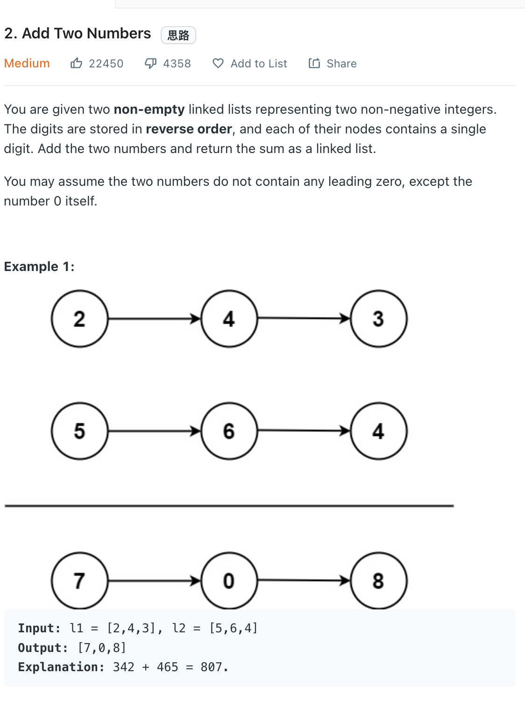

___
[2. Add Two Numbers](https://leetcode.com/problems/add-two-numbers/)
___

## 分析问题
* This is a real classic `Linked List` question
* We need to take care of the `carry`.
* If the length of `l1` and `l2` are not equal
* If the `carry` are not 0 at the end of the loop

## 基本思路
* While `l1` or `l2` not `Null`, we sum together with `carry` and find out the new `carry`, then put into a new node. Then update `l1`, `l2` and new node 

___
```python
    def addTwoNumbers(self, l1: Optional[ListNode], l2: Optional[ListNode]) -> Optional[ListNode]:
        dummy_head = ListNode(-1)
        head = dummy_head
        carry = 0
        
        while l1 or l2 or carry > 0:
            sum = 0
            if l1:
                sum += l1.val
                l1 = l1.next
            if l2:
                sum += l2.val
                l2 = l2.next
            sum += carry
            
            carry = sum // 10
            sum %= 10
            
            head.next = ListNode(sum)
            head = head.next

        return dummy_head.next
```