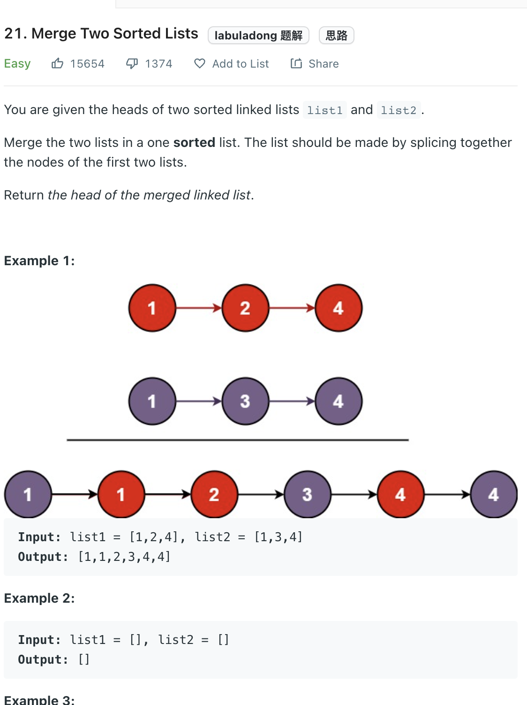

___
[21. Merge Two Sorted Lists](https://leetcode.com/problems/merge-two-sorted-lists/)
___

## 分析问题
* This question is pretty straight forward 

## 基本思路
* We can have a `dummy_head` that will help us to return the answer.
* Two pointers are `l1` and `l2`
* If `l1` is smaller, we make `l1` euqals to our next value and update `l1` = `l1.next`
* Something need to notice before we return the answer. If we finished the comparsion and there are still `l1` or `l2` left, we need to append the whole `l1` or `l2` and the end of our `dummy_head`

___
```python
    def mergeTwoLists(self, l1: Optional[ListNode], l2: Optional[ListNode]) -> Optional[ListNode]:
        dummy_head = ListNode(-1)
        
        head = dummy_head
        
        while l1 and l2:
            if l1.val <= l2.val:
                head.next = l1
                l1 = l1.next
            else:
                head.next = l2
                l2 = l2.next
            head = head.next
    
        head.next = l1 if l1 != None else l2
        
        
        return dummy_head.next
```