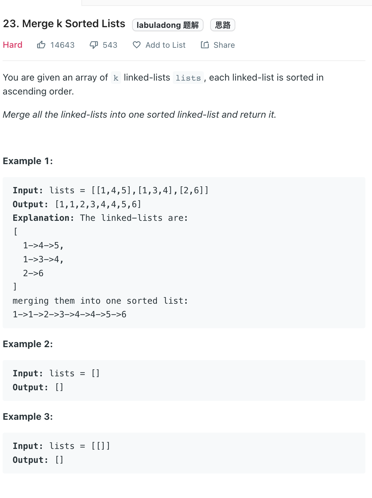

___
[23. Merge k Sorted Lists](https://leetcode.com/problems/merge-k-sorted-lists/)
___

## 分析问题
* This is a classic PriorityQueue question

## 基本思路
* Create a `min heap`
* Inorder to decrease the memory usage, we put node one by one into the `queue`.
* In this way, we can make sure that the maxmium size of `queue` is `n`

___

m == total nodes in lists
`Time complexity : O(nlog(m))`

`Space complexity : O(n)`
```java
public ListNode mergeKLists(ListNode[] lists) {
        PriorityQueue<ListNode> queue = new PriorityQueue<>((a, b) -> a.val - b.val);
        
        for (ListNode node: lists) {
            if (node != null) { queue.add(node); }
        }
        
        
        ListNode dummy = new ListNode();
        ListNode tempNode = dummy;
        
        while (!queue.isEmpty()) {
            tempNode.next = queue.poll();
            tempNode = tempNode.next;
            if (tempNode.next != null) {
                queue.add(tempNode.next);
            }
        }
        return dummy.next;
    }
```