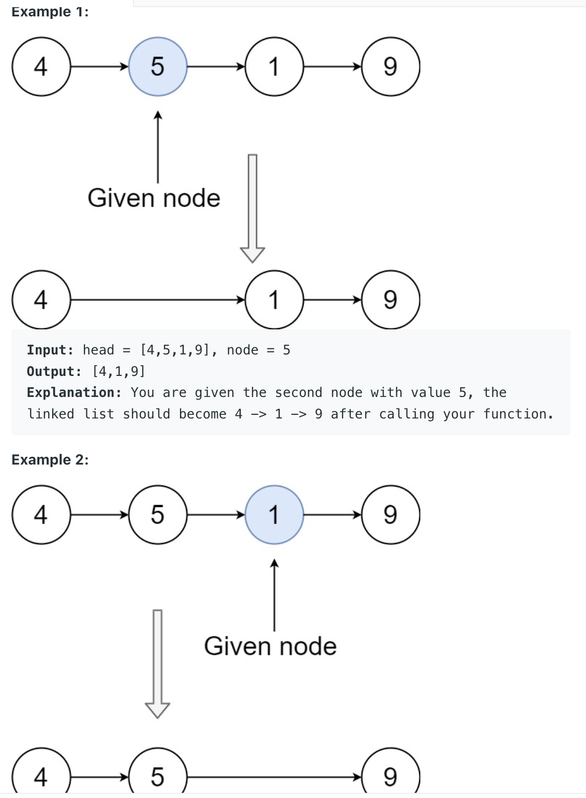

___
[237. Delete Node in a Linked List](https://leetcode.com/problems/delete-node-in-a-linked-list/)
___

## 基本思路
* 这题是脑筋急转弯。。。。

___

`Time complexity : O(1)`

`Space complexity : O(1)`
```python
class Solution:
    def deleteNode(self, node):
        """
        :type node: ListNode
        :rtype: void Do not return anything, modify node in-place instead.
        """
        node.val = node.next.val
        node.next = node.next.next
```