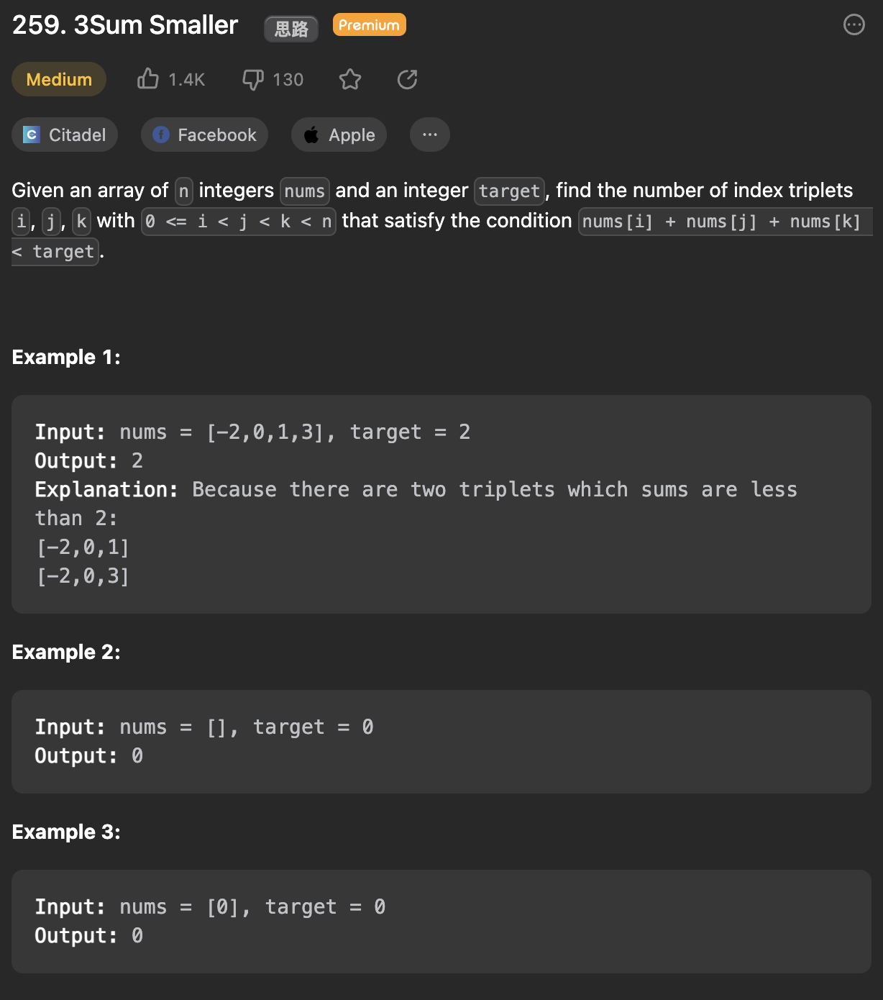

___
[259. 3Sum Smaller](https://leetcode.com/problems/3sum-smaller/description/)
___


## 基本思路
* The key point is how to find total counts?
* `answer += right - left`
* Since we already sorted this array, so all num will valid as long as they are in range of [left, right]
* 

___

`Time complexity : O(nlog(n))`

`Space complexity : O(1)`
```python
class Solution:
    def threeSumSmaller(self, nums: List[int], target: int) -> int:
        nums.sort()
        answer = 0
        for i in range(len(nums)):
            left = i + 1
            right = len(nums) - 1
            
            while left < right:
                total = nums[i] + nums[left] + nums[right]
                if total < target:
                    answer += right - left
                    left += 1
                else:
                    right -= 1

        return answer
```