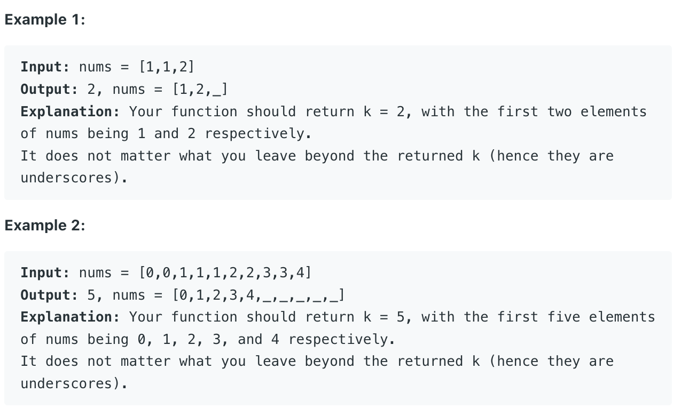

___
[26. Remove Duplicates from Sorted Array](https://leetcode.com/problems/remove-duplicates-from-sorted-array/)
___

## 基本思路
* Normal Two Pointer

___

`Time complexity : O(n)`

`Space complexity : O(1)`
```python
class Solution:
    def removeDuplicates(self, nums: List[int]) -> int:
        left = 0
        right = 1
        
        while right < len(nums):
            if nums[right] != nums[right - 1]:
                left += 1
                nums[left] = nums[right]
                
            right += 1
        return left + 1
```